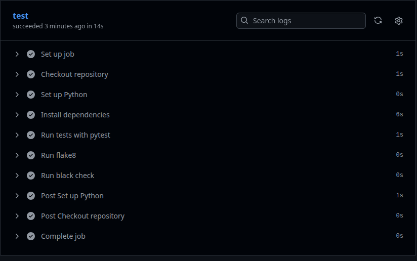

# **PHASE 1 — LES FONDATIONS DU CI/CD** [[1]](#ref1)

## **Comprendre et visualiser le concept**

------

### **1. Qu’est-ce que CI/CD ?**

**CI/CD** = *Continuous Integration / Continuous Delivery (ou Deployment)*.
 C’est une **philosophie d’automatisation du cycle de développement logiciel**.

#### **1.1. Continuous Integration (CI)**

> “Chaque fois qu’un développeur pousse du code, il est automatiquement testé et validé.”

L’idée :

- Tu ne veux plus attendre la fin du projet pour tester ton code.
- Chaque *commit* déclenche un processus automatique :
  - Télécharger le code.
  - Installer les dépendances.
  - Lancer les tests.
  - Analyser la qualité du code.

**Objectif :** détecter les erreurs immédiatement.

**Exemple concret** :

> Imagine 5 développeurs qui bossent sur un site e-commerce.
>  Sans CI, ils découvrent que leurs changements cassent la page panier **3 jours plus tard**.
>  Avec CI, GitHub Actions lance les tests **à chaque push** et signale immédiatement l’erreur.

------

#### **1.2. Continuous Delivery (CD)**

> “Le code testé est automatiquement préparé pour être déployé.”

- À chaque validation (tests réussis), le code est **packagé** :
  - Création d’une image Docker, d’un fichier .zip ou .jar.
  - Stockage dans un registre (DockerHub, GitHub Packages…).
- Le déploiement n’est pas encore automatique, il faut une validation humaine.

------

#### **1.3. Continuous Deployment**

> “Le code validé est automatiquement déployé sur un serveur ou un cloud.”

Ici, plus besoin de cliquer sur quoi que ce soit :

- GitHub Actions → Build → Test → Push → Deploy automatique sur Render, AWS, etc.

------

### **2. Le pipeline logiciel**

#### **2.1 Outils et écosystème**

- Git et GitHub (ou GitLab)
- Docker (fondamental pour le packaging)
- **Serveurs CI/CD** : GitHub Actions, Jenkins, GitLab CI, CircleCI
- **Cloud providers** : AWS, Azure, ou Render/Heroku pour commencer

Voici une représentation du pipeline CI/CD :

```basic
Développeur → git add . → git commit -m "Un message" → git push
    ↓
[Pipeline CI]
    - Build du code
    - Tests unitaires
    - Analyse qualité
    ↓
[Pipeline CD]
    - Build Docker image
    - Push image sur DockerHub
    - Déploiement sur le serveur
    ↓
Application en ligne
```

------


## **Mise en pratique - Premier microservice + workflow Git**

On va passer au **projet pratique** : ton premier microservice Python avec Flask.

------

### **3. Projet pratique : Hello Microservice**

#### **Objectif**

Créer une API Flask minimaliste et la déployer manuellement.
Tu comprendras le flux : 

```less
Git → add → commit → push → déploiement manuel.
```

------

### **Étape 1 : Préparer ton environnement**

**Pré-requis :**

- Python 3.x installé
- Git installé
- Un compte GitHub créé

**Vérifie les installations :**

```bash
python --version
git --version
```

------

### **Étape 2 : Créer le projet localement**

Crée un dossier :

```bash
mkdir hello-ci-cd && cd hello-ci-cd
```

Initialise Git :

```bash
git init
```

Crée ton environnement virtuel :

```bash
python -m venv venv
source venv/bin/activate   # macOS/Linux
venv\Scripts\activate      # Windows
```

Installe Flask :

```bash
pip install --upgrade pip && pip install flask gunicorn
pip freeze > requirements.txt
```

------


### **Étape 3 : Créer ton microservice**

Crée le fichier `app/app.py` :

```python
from flask import Flask

app = Flask(__name__)

@app.route("/hello")
def hello():
    return {"message": "Hello world from CI/CD!"}

if __name__ == "__main__":
    app.run(host="0.0.0.0", port=5801)
```

Teste localement :

```bash
gunicorn app.app:app
```

ou 

```bash
python app/app.py
```

Dans ton navigateur :
 👉 http://localhost:5801/hello

Tu devrais voir :

```json
{"message": "Hello World from CI/CD!"}
```

------

### **Étape 4 : Versionner ton code sur GitHub**

Crée un dépôt vide sur GitHub appelé `hello-ci-cd`.

Dans ton terminal :

```bash
git add .
git commit -m "Initial commit: Flask hello microservice"
git branch -M main
git remote add origin https://github.com/<ton_username>/hello-ci-cd.git
git push -u origin main
```

------

### **Étape 5 : Déploiement manuel (premier pas vers le CD)**

On ne fait pas encore d’automatisation : tu vas juste lancer l’app sur un petit cloud gratuit.
Choisis l’un de ces trois :

1. **Render** (simple, gratuit, YAML friendly)
2. **Railway.app** (super intuitif)
3. **Heroku** (un peu moins gratuit, mais très formateur)

Exemple avec **Render** :

- Va sur [https://render.com](https://render.com/)

- Connecte ton GitHub

- Clique sur “New → Web Service”

- Sélectionne ton repo `hello-ci-cd`

- Commande de démarrage :

  ```less
  gunicorn app.app:app
  ```

  ou  

  ```less
  python app/app.py
  ```

- Port : `5801`

- Clique sur “Deploy” 

Tu viens de **faire ton premier déploiement manuel**, la base du “D” dans CI/CD.

### **Étape 5 : Tester**

Va sur https://hello-ci-cd-xxxx.onrender.com/hello

xxxx est fournie par render

Tu devrais voir :

```json
{"message": "Hello World from CI/CD!"}
```

------

### **Étape 6 : Visualise ton premier pipeline (mentalement)**

Tu as fait : 

```less
Code → Test local → Add → Commit → Push → Déploiement (manuel)→ Accéder au service
```

Tu as donc déjà **le squelette du pipeline**.

------

### **Étape 7 : Bonus, Préparer le Dockerfile**

Même si tu ne l’utilises pas encore, prépare ton Dockerfile (il servira en Phase 2) :

Crée un fichier `Dockerfile` :

```Dockerfile
# Étape 1 : Image de base
FROM python:3.12-slim

# Étape 2 : Dossier de travail
WORKDIR /app

# Étape 3 : Copier les fichiers
COPY requirements.txt .
RUN pip install --upgrade pip && pip install -r requirements.txt

# Étape 4 : Copier le reste du code
COPY . .

# Étape 5 : Lancer l'application
ENTRYPOINT ["python"]
CMD ["app/app.py"]
```

Teste ton build :

```bash
docker build -t hello-ci-cd .
docker run -d -p 5801:5801 --name hello hello-ci-cd
```

------

Vérifie : 

```basic
>> docker ps
CONTAINER ID   IMAGE         COMMAND               CREATED          STATUS          PORTS                                         NAMES
051d7ccde480   hello-ci-cd   "python app/app.py"   20 seconds ago   Up 20 seconds   0.0.0.0:5801->5801/tcp, [::]:5801->5801/tcp   hello
```

Va sur  👉 http://localhost:5801/hello

Tu devrais voir :

```json
{"message": "Hello World from CI/CD!"}
```

### **Fait :**

✅ Le concept CI/CD et son intérêt

✅ Le pipeline logique d’un projet moderne

✅ Git et GitHub en pratique

✅ La création et le déploiement manuel sur render d’un microservice Flask

✅ Les bases de Docker pour la suite


------

# **PHASE 2 — CONTINUOUS INTEGRATION**

------

## **1. Concepts clés**

### **1.1. Qu’est-ce que l’intégration continue ?**

L’**intégration continue (CI)** consiste à **tester et valider automatiquement ton code à chaque changement**.
 Chaque fois que tu fais un *push* ou une *pull request*, ton pipeline :

- Récupère le code.
- Installe les dépendances.
- Lance les tests.
- Analyse la qualité du code.

**But :** éviter que des erreurs cachées se propagent dans le projet principal.

**Philosophie :**

> “Ne garde jamais du code qui n’a pas été testé.”

------

### **1.2. Pourquoi automatiser les tests à chaque commit ?**

- Pour **gagner du temps** : tu détectes les bugs dès qu’ils apparaissent.
- Pour **assurer la stabilité du code** : chaque contribution est validée.
- Pour **éviter les régressions** : une fonction corrigée ne re-casse pas plus tard.

**Exemple concret** : Tu modifies `/hello` pour `/hi`. Si un test automatisé échoue, tu sais immédiatement que ta modification a brisé une route existante.

------

### **1.3. Quand lancer le pipeline CI ?**

En général :

- À **chaque push** sur une branche (`main`, `develop`, etc.).
- À **chaque pull request** ouverte vers `main`.
- ***Optionnellement*** : sur un **workflow manuel** ou planifié (cron).

------

### **1.4. Prévenir la dette technique**

La dette technique, c’est tout code “sale” ou non testé qui finira par ralentir le projet.
 Le CI la prévient en :

- refusant les commits qui ne passent pas les tests ;
- forçant les règles de style (flake8, black) ;
- maintenant une qualité de code constante.
  

------

## **2. Outils essentiels**

### **2.1. GitHub Actions**

GitHub Actions, c’est le **cerveau CI/CD intégré à GitHub**.
Il permet d’exécuter des workflows en YAML : chaque push, test ou déploiement suit un scénario défini.

Éléments clés :

- **Jobs** : unités de travail (ex. “Test” ou “Build”).
- **Steps** : actions dans un job.
- **Runners** : machines virtuelles qui exécutent ton workflow.
- **Secrets** : variables d’environnement sécurisées.

------

### **2.2. pytest**

Un framework de test Python ultra simple. Il détecte automatiquement les fichiers commençant par `test_`.

------

### **2.3. flake8 et black**

- **flake8** : analyse le style de ton code et détecte les erreurs (linting).
- **black** : reformate automatiquement ton code (formatting).

------

## **3. Exemple concret : Ton premier pipeline CI**

### **Projet : ton API Flask “hello-ci-cd”**

On va :

- ajouter un test automatisé,
- configurer un pipeline GitHub Actions,
- exécuter les tests à chaque push.

------

### **Étape 1 : Ajouter un test avec pytest**

Crée un dossier `tests/` à la racine :

```bash
mkdir tests
```

Puis crée le fichier `tests/test_app.py` :

```python
from app.app import app

def test_hello_route():
    client = app.test_client()
    response = client.get("/hello")
    assert response.status_code == 200
    assert response.get_json() == {"message": "Hello world from CI/CD!"}
```

Ajoute le dossier courant dans le chemin des modules importables. Créer un fichier `pytest.ini` à la racine du projet :

```python
# pytest.ini
pytest]
pythonpath = .
```

Teste localement :

```bash
pytest -v
```

------

Sortie attendue : 

```basic
====================================================== test session starts =======================================================
platform linux -- Python 3.12.3, pytest-7.4.4, pluggy-1.4.0 -- /usr/bin/python3
cachedir: .pytest_cache
rootdir: ~/docker_compose/hello-ci-cd
configfile: pytest.ini
plugins: anyio-4.10.0, langsmith-0.4.30
collected 1 item                                                                                                                 
tests/test_app.py::test_hello_route PASSED                                                                                 [100%]

======================================================= 1 passed in 0.08s ========================================================
```

Ton test **passe à 100 %**, ce qui veut dire que ton microservice Flask fonctionne exactement comme prévu et que ton environnement de test `pytest` est **opérationnel**.

Tu viens d’accomplir **la première vraie validation d’une phase CI** locale :

- le code est testé automatiquement,
- le résultat est clair,
- et les tests sont reproductibles.

La prochaine étape naturelle, c’est d’automatiser **tout ce que tu viens de faire localement** avec **GitHub Actions**, pour que :

> À chaque *push* ou *pull request*, GitHub exécute ton pipeline de tests tout seul.


### **Étape 2 : Installer les dépendances CI**

Ajoute ces outils à ton `requirements-dev.txt` :

```less
pytest 
flake8 
black
```

✅ `requirements.txt` = prod
✅ `requirements-dev.txt` = dev & CI
✅ `pytest`, `flake8`, `black` seulement côté dev


------

### **Étape 3 : Créer ton pipeline GitHub Actions**

Dans ton projet, crée un dossier `.github/workflows` :

```bash
mkdir -p .github/workflows
```

Puis ajoute un fichier nommé `ci.yml` :

```yaml
name: CI - Hello CI/CD
on:
  push:
    branches: [ main ]
  pull_request:
    branches: [ main ]
jobs:
  test:
    runs-on: ubuntu-latest
    steps:
      - name: Checkout repository
        uses: actions/checkout@v4
      
      - name: Set up Python
        uses: actions/setup-python@v5
        with:
          python-version: '3.12'
      
      - name: Install dependencies
        run: |
          python -m pip install --upgrade pip
          pip install -r requirements-dev.txt
      
      - name: Run tests with pytest
        run: pytest -v
      
      - name: Run flake8
        run: flake8 app tests
      
      - name: Run black check
        run: black --check app tests
```

------

### 💡 Explications pro

Une assistante IA commente le fichier ci-dessus : [Explications pipeline](./explications_pipeline_ci-cd.md)

### **Étape 4 : Tester le pipeline**

1. **Vérifie ton test localement :**

   Avant de pousser :

   ```bash
   pytest -v
   flake8 app tests
   black --check app tests
   ```

2. Si tout passe, committe le fichier :

   ```bash
   git add .github/workflows/ci.yml
   git commit -m "Add CI pipeline with pytest, black and flake8"
   git push
   ```

3. Va sur GitHub → **Actions** → tu verras ton pipeline “CI Pipeline” démarrer.

   Si tout passe, tu verras un truc simalaire à la capture suivante

   

4. Si tout passe, chaque push sera validé automatiquement.

------

### **Étape 5 : Quand exécuter la CI ?**

- **Sur chaque push** : pour vérifier ton code en continu.
- **Sur chaque pull request** : avant d’intégrer une branche dans `main`.

*(Tu peux ajuster la section `on:` dans le YAML selon ton workflow.)*

------

### **Étape 6 : Gérer les secrets dans GitHub Actions**

Si ton pipeline nécessite des variables sensibles (API_KEY, TOKEN, etc.),
 ne les mets **jamais dans ton code**.

Dans ton repo GitHub :
 **Settings → Secrets and variables → Actions → New repository secret**

Puis tu y ajoutes, par exemple :

- `DOCKERHUB_USERNAME`
- `DOCKERHUB_TOKEN`
- `RENDER_API_KEY`

Ensuite, tu peux y accéder dans ton YAML :

```yaml
env:
  DOCKER_USER: ${{ secrets.DOCKERHUB_USERNAME }}
```

------

### **Étape 7 : Pourquoi isoler les environnements avec Docker ?**

GitHub Actions te donne des runners “propres” à chaque exécution.
 Mais dans un contexte pro :

- Tu veux t’assurer que ton code tourne **dans le même environnement partout**.
- Docker garantit la **portabilité** : le même container local = le même container dans la CI.

Exemple :

```yaml
container:
  image: python:3.10-slim
```

→ Tous tes tests s’exécuteront dans un environnement Docker isolé.

------

## **Résumé — À la fin de la Phase 2, tu maîtrises :**

✅ Les principes fondamentaux de l’intégration continue

✅ La mise en place d’un pipeline automatisé avec GitHub Actions

✅ Les tests unitaires avec pytest

✅ L’analyse de code avec flake8 et black

✅ La gestion des secrets CI/CD

✅ L’isolation environnementale via Docker

------


**Status badge** : 

# RÉFÉRENCES

[<a id="ref1">1</a>] [PHASE 1](https://github.com/Bamolitho/hello-ci-cd)  

[<a id="ref2">2</a>] [Texte a afficher_][Lien]
