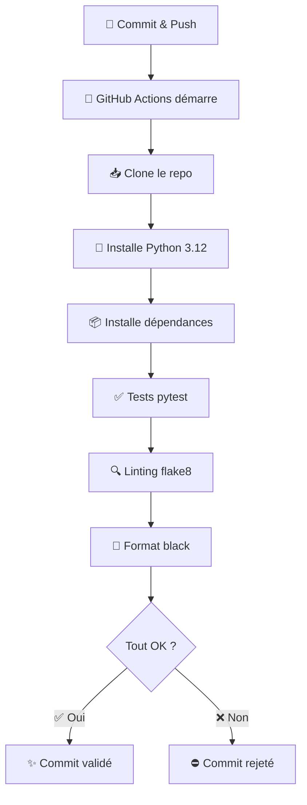
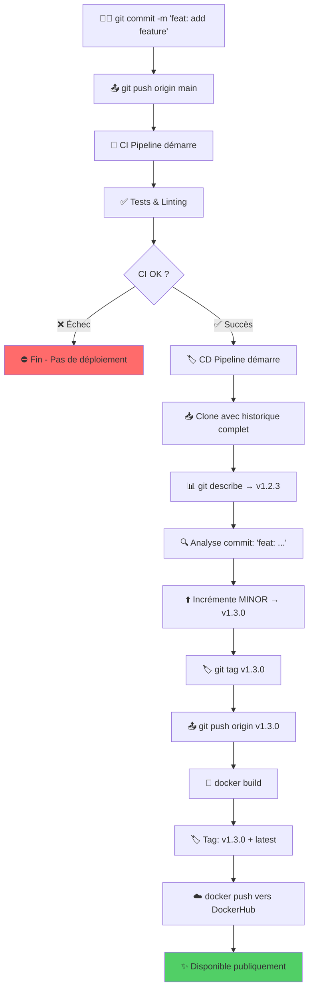
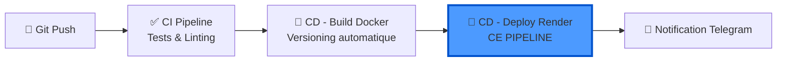
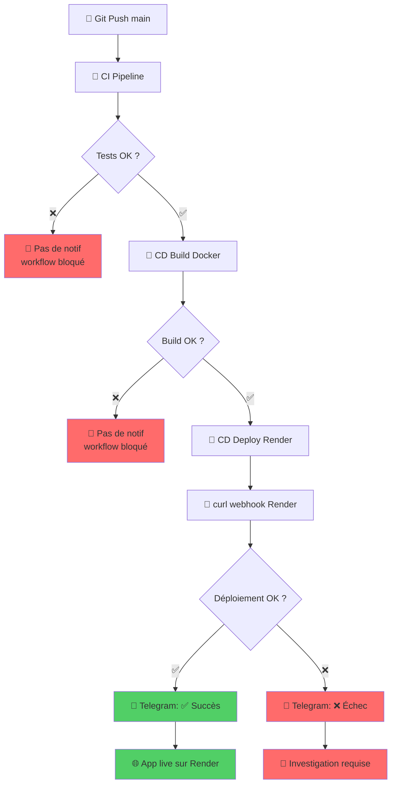

# 💡 Explications professionnelles du pipeline CI/CD

## 📁 Structure du fichier `ci.yml`

Ce fichier définit un **pipeline d'intégration continue** qui s'exécute automatiquement à chaque modification du code.

```yaml
name: CI - Hello CI/CD
on:
  push:
    branches: [ main ]
  pull_request:
    branches: [ main ]
jobs:
  test:
    runs-on: ubuntu-latest
    steps:
      - name: Checkout repository
        uses: actions/checkout@v4
      
      - name: Set up Python
        uses: actions/setup-python@v5
        with:
          python-version: '3.12'
      
      - name: Install dependencies
        run: |
          python -m pip install --upgrade pip
          pip install -r requirements-dev.txt
      
      - name: Run tests with pytest
        run: pytest -v
      
      - name: Run flake8
        run: flake8 app tests
      
      - name: Run black check
        run: black --check app tests
```

------

## 🔍 Décortiquons chaque section

### 1️⃣ **Déclencheurs (Triggers)**

```yaml
on:
  push:
    branches: [ main ]
  pull_request:
    branches: [ main ]
```

- **`push`** : Le pipeline s'exécute à chaque commit poussé sur la branche `main`
- **`pull_request`** : Le pipeline s'exécute aussi quand on crée/met à jour une PR (pull request) vers `main`
- **Pourquoi ?** Valider le code AVANT qu'il n'atteigne la production

------

### 2️⃣ **Environnement d'exécution**

```yaml
jobs:
  test:
    runs-on: ubuntu-latest
```

- **`runs-on: ubuntu-latest`** : GitHub crée une machine virtuelle Ubuntu fraîche
- Chaque exécution démarre avec un environnement propre et isolé
- **Avantage** : Tests reproductibles, pas de "ça marche sur ma machine" 🎯

------

### 3️⃣ **Les étapes (Steps)**

#### 📥 **Étape 1 : Récupération du code**

```yaml
- name: Checkout repository
  uses: actions/checkout@v4
```

- Clone votre dépôt Git dans la machine virtuelle
- Sans ça, GitHub Actions n'aurait pas accès à votre code !

------

#### 🐍 **Étape 2 : Configuration de Python**

```yaml
- name: Set up Python
  uses: actions/setup-python@v5
  with:
    python-version: '3.12'
```

- Installe Python 3.12 sur la machine virtuelle
- **Bonne pratique** : Utiliser la même version qu'en production

------

#### 📦 **Étape 3 : Installation des dépendances**

```yaml
- name: Install dependencies
  run: |
    python -m pip install --upgrade pip
    pip install -r requirements-dev.txt
```

- **`pip install --upgrade pip`** : S'assure d'avoir la dernière version de pip

- `requirements-dev.txt`

   : Installe TOUTES les dépendances :

  - ✅ Dépendances de production (Flask, gunicorn...)
  - ✅ Outils de développement (pytest, flake8, black...)

**💡 Pourquoi `requirements-dev.txt` ?**

```txt
-r requirements.txt    ← Charge d'abord les dépendances de prod
pytest                 ← Puis ajoute les outils de dev
flake8
black
```

------

#### ✅ **Étape 4 : Tests unitaires**

```yaml
- name: Run tests with pytest
  run: pytest -v
```

- **`pytest -v`** : Exécute tous les tests avec mode verbose (détaillé)
- **Si un test échoue** → ❌ Le pipeline s'arrête et le commit est marqué comme "failed"
- **Si tous les tests passent** → ✅ Continue vers les étapes suivantes

------

#### 🔍 **Étape 5 : Vérification du style (Linting)**

```yaml
- name: Run flake8
  run: flake8 app tests
```

- **flake8** : Vérifie que le code respecte les conventions Python (PEP 8)
- Détecte :
  - Lignes trop longues
  - Variables non utilisées
  - Imports inutiles
  - Erreurs de syntaxe subtiles

**Exemple d'erreur détectée :**

```python
# ❌ flake8 va signaler :
def ma_fonction( x,y ):  # Espaces incorrects
    variable_inutilisee = 10
    return x+y  # Manque d'espaces autour de +
```

------

#### 🎨 **Étape 6 : Formatage du code**

```yaml
- name: Run black check
  run: black --check app tests
```

- **black** : Vérificateur de formatage automatique
- **`--check`** : Ne modifie PAS le code, juste vérifie s'il est bien formaté
- **Si le code n'est pas formaté** → ❌ Échec du pipeline

**Pour corriger automatiquement :**

```bash
black app tests  # Sans --check, black reformate directement
```

La **bonne pratique pro** est :

> ➤ `--check` dans le pipeline CI
>  ➤ **sans** `--check` en local (avant de pousser ton code)


## 🎯 Workflow complet en action



------

## 🛡️ Avantages de cette approche

| Étape      | Protège contre        | Exemple                                               |
| ---------- | --------------------- | ----------------------------------------------------- |
| **pytest** | Bugs et régressions   | Une fonction qui retourne `None` au lieu d'une valeur |
| **flake8** | Code non-maintenable  | Variables non utilisées, imports inutiles             |
| **black**  | Incohérences de style | Équipe avec différents styles de formatage            |

------

## 🚀 Bonnes pratiques appliquées

1. ✅ **Tests automatisés** : Impossible de merger du code cassé
2. ✅ **Qualité de code** : Standards uniformes dans toute l'équipe
3. ✅ **Formatage cohérent** : Plus de débats sur "où mettre les espaces"
4. ✅ **Feedback rapide** : Sait en 15 secondes si le code est valide
5. ✅ **Documentation vivante** : Le pipeline documente les standards attendus

------

## 📊 Résultat sur GitHub

Chaque commit affiche :

- ✅ **Vert** : Tous les checks passent → Prêt pour review/merge
- ❌ **Rouge** : Au moins un check échoue → À corriger avant merge
- 🟡 **Jaune** : Pipeline en cours d'exécution

```less
✅ CI - Hello CI/CD  (15s)
   ✅ test / Checkout repository
   ✅ test / Set up Python
   ✅ test / Install dependencies
   ✅ test / Run tests with pytest
   ✅ test / Run flake8
   ✅ test / Run black check
```

------

**🎓 En résumé** : Ce pipeline transforme votre dépôt en une **usine automatisée** qui vérifie la qualité à chaque modification. C'est la base d'une équipe qui livre du code fiable ! 🚀


# 💡 Explication complète du pipeline CD avec versioning automatique

## 📋 Vue d'ensemble

Ce pipeline CD est une **version évoluée** qui ajoute une fonctionnalité cruciale : **le versioning sémantique automatique**. Au lieu de simplement publier une image `latest`, il crée automatiquement des versions numérotées (v1.0.0, v1.1.0, etc.) basées sur vos commits.


## 📁 Structure du fichier `cd.yml`

```yaml
name: CD - Build, Tag & Push Docker Image

on:
  workflow_run:
    workflows: ["CI - Hello CI/CD"]
    types: [completed]

permissions:
  contents: write

jobs:
  build-tag-push:
    if: ${{ github.event.workflow_run.conclusion == 'success' }}
    runs-on: ubuntu-latest

    steps:
      - name: Checkout repository
        uses: actions/checkout@v4
        with:
          fetch-depth: 0  # nécessaire pour les tags Git

      - name: Set up Docker Buildx
        uses: docker/setup-buildx-action@v3

      - name: Get current version
        id: get_version
        run: |
          VERSION=$(git describe --tags --abbrev=0 2>/dev/null || echo "v0.0.0")
          echo "Current version: $VERSION"
          echo "version=$VERSION" >> $GITHUB_OUTPUT

      - name: Detect commit type and bump version
        id: bump_version
        run: |
          COMMIT_MSG=$(git log -1 --pretty=%B)
          echo "Last commit: $COMMIT_MSG"

          MAJOR=$(echo "${{ steps.get_version.outputs.version }}" | cut -d. -f1 | tr -d 'v')
          MINOR=$(echo "${{ steps.get_version.outputs.version }}" | cut -d. -f2)
          PATCH=$(echo "${{ steps.get_version.outputs.version }}" | cut -d. -f3)

          if [[ "$COMMIT_MSG" == *"BREAKING CHANGE"* ]]; then
            MAJOR=$((MAJOR + 1)); MINOR=0; PATCH=0
          elif [[ "$COMMIT_MSG" == feat:* ]]; then
            MINOR=$((MINOR + 1)); PATCH=0
          else
            PATCH=$((PATCH + 1))
          fi

          NEW_VERSION="v${MAJOR}.${MINOR}.${PATCH}"
          echo "New version: $NEW_VERSION"
          echo "new_version=$NEW_VERSION" >> $GITHUB_OUTPUT

      - name: Create and push new Git tag
        env:
          GITHUB_TOKEN: ${{ secrets.GITHUB_TOKEN }}
        run: |
          git config user.name "${{ github.actor }}"
          git config user.email "${{ github.actor }}@users.noreply.github.com"
          git tag ${{ steps.bump_version.outputs.new_version }}
          git push origin ${{ steps.bump_version.outputs.new_version }}

      - name: Log in to DockerHub
        uses: docker/login-action@v3
        with:
          username: ${{ secrets.DOCKERHUB_USERNAME }}
          password: ${{ secrets.DOCKERHUB_TOKEN }}

      - name: Build & Push Docker image with version tag
        uses: docker/build-push-action@v6
        with:
          context: .
          push: true
          tags: |
            ${{ secrets.DOCKERHUB_USERNAME }}/hello-ci-cd:${{ steps.bump_version.outputs.new_version }}
            ${{ secrets.DOCKERHUB_USERNAME }}/hello-ci-cd:latest
```


------

## 🎯 Ce que fait ce pipeline en résumé

```
1. ✅ Attend que le CI réussisse
2. 📊 Lit la dernière version Git (ex: v1.2.3)
3. 🔍 Analyse le message du dernier commit
4. ⬆️ Incrémente automatiquement la version selon les règles
5. 🏷️ Crée un nouveau tag Git (ex: v1.2.4)
6. 🐳 Construit l'image Docker avec 2 tags :
   - hello-ci-cd:v1.2.4 (version spécifique)
   - hello-ci-cd:latest (toujours la dernière)
7. ☁️ Publie tout sur DockerHub
```

------

## 📄 Décortiquons le code section par section

### 1️⃣ En-tête et déclencheur

```yaml
name: CD - Build, Tag & Push Docker Image
on:
  workflow_run:
    workflows: ["CI - Hello CI/CD"]
    types: [completed]
```

**Identique à l'ancienne version** : Se déclenche après la complétion du workflow CI.

------

### 2️⃣ Permissions spéciales

```yaml
permissions:
  contents: write
```

**🔑 Nouveau : Permission d'écriture**

- **`contents: write`** : Autorise le workflow à **modifier le dépôt Git**
- **Pourquoi ?** Pour créer et pousser des tags Git automatiquement
- **Sans cette ligne** : Erreur `Permission denied` lors du push du tag

**📊 Niveaux de permissions GitHub Actions :**

| Permission        | Lecture | Écriture | Usage                      |
| ----------------- | ------- | -------- | -------------------------- |
| `contents: read`  | ✅       | ❌        | Clone le code (par défaut) |
| `contents: write` | ✅       | ✅        | Clone + push tags/branches |

------

### 3️⃣ Job principal

```yaml
jobs:
  build-tag-push:
    if: ${{ github.event.workflow_run.conclusion == 'success' }}
    runs-on: ubuntu-latest
```

**Garde de sécurité** : N'exécute le job QUE si le CI a réussi (comme avant).

------

### 4️⃣ Étape 1 : Clone avec historique complet

```yaml
steps:
  - name: Checkout repository
    uses: actions/checkout@v4
    with:
      fetch-depth: 0  # nécessaire pour les tags Git
```

**🔍 Différence critique : `fetch-depth: 0`**

#### Comparaison :

| Sans `fetch-depth: 0`              | Avec `fetch-depth: 0`           |
| ---------------------------------- | ------------------------------- |
| Clone uniquement le dernier commit | Clone **tout l'historique Git** |
| ❌ Pas d'accès aux tags             | ✅ Accès à tous les tags         |
| ❌ `git describe` échoue            | ✅ `git describe` fonctionne     |

**💡 Pourquoi c'est nécessaire ?**

```bash
# Sans fetch-depth: 0
git describe --tags --abbrev=0
# Erreur : fatal: No names found, cannot describe anything.

# Avec fetch-depth: 0
git describe --tags --abbrev=0
# Résultat : v1.2.3
```

**🎯 Analogie :**

- Sans : Vous ouvrez un livre à la dernière page uniquement
- Avec : Vous avez le livre complet et pouvez lire l'index

------

### 5️⃣ Étape 2 : Configuration de Docker Buildx

```yaml
- name: Set up Docker Buildx
  uses: docker/setup-buildx-action@v3
```

**Identique à l'ancienne version** : Configure l'outil moderne de build Docker.

------

### 6️⃣ Étape 3 : Récupération de la version actuelle

```yaml
- name: Get current version
  id: get_version
  run: |
    VERSION=$(git describe --tags --abbrev=0 2>/dev/null || echo "v0.0.0")
    echo "Current version: $VERSION"
    echo "version=$VERSION" >> $GITHUB_OUTPUT
```

**🔍 Analyse ligne par ligne :**

#### **Ligne 1 : Récupération du dernier tag**

```bash
VERSION=$(git describe --tags --abbrev=0 2>/dev/null || echo "v0.0.0")
```

**Décortiquons cette commande complexe :**

| Partie                | Signification                              | Exemple          |
| --------------------- | ------------------------------------------ | ---------------- |
| `git describe --tags` | Trouve le tag le plus récent               | v1.2.3-5-gabc123 |
| `--abbrev=0`          | Affiche uniquement le tag, pas le hash     | v1.2.3           |
| `2>/dev/null`         | Supprime les erreurs (si aucun tag existe) | (silencieux)     |
| `|| echo "v0.0.0"`    | Si échec, utilise v0.0.0 par défaut        | v0.0.0           |

**📊 Scénarios possibles :**

```bash
# Scénario 1 : Premier déploiement (aucun tag)
$ git describe --tags --abbrev=0
fatal: No names found
$ VERSION = "v0.0.0"  # Valeur par défaut

# Scénario 2 : Déploiements précédents existent
$ git describe --tags --abbrev=0
v1.2.3
$ VERSION = "v1.2.3"
```

#### **Ligne 2 : Affichage pour debug**

```bash
echo "Current version: $VERSION"
```

Affiche dans les logs GitHub Actions : `Current version: v1.2.3`

#### **Ligne 3 : Exportation vers les autres étapes**

```bash
echo "version=$VERSION" >> $GITHUB_OUTPUT
```

**🔑 Mécanisme GitHub Actions : Partage de données entre steps**

```
┌─────────────────────┐
│  Step 1: get_version│
│  OUTPUT: v1.2.3     │
└──────────┬──────────┘
           │
           ▼
┌─────────────────────┐
│  Step 2: bump_version│
│  INPUT: v1.2.3      │
└─────────────────────┘
```

**Syntaxe d'utilisation :**

```yaml
# Définir une sortie
echo "ma_variable=valeur" >> $GITHUB_OUTPUT

# Utiliser dans un autre step
${{ steps.get_version.outputs.ma_variable }}
```

------

### 7️⃣ Étape 4 : Détection du type de commit et incrémentation

```yaml
- name: Detect commit type and bump version
  id: bump_version
  run: |
    COMMIT_MSG=$(git log -1 --pretty=%B)
    echo "Last commit: $COMMIT_MSG"
    
    MAJOR=$(echo "${{ steps.get_version.outputs.version }}" | cut -d. -f1 | tr -d 'v')
    MINOR=$(echo "${{ steps.get_version.outputs.version }}" | cut -d. -f2)
    PATCH=$(echo "${{ steps.get_version.outputs.version }}" | cut -d. -f3)
    
    if [[ "$COMMIT_MSG" == *"BREAKING CHANGE"* ]]; then
      MAJOR=$((MAJOR + 1)); MINOR=0; PATCH=0
    elif [[ "$COMMIT_MSG" == feat:* ]]; then
      MINOR=$((MINOR + 1)); PATCH=0
    else
      PATCH=$((PATCH + 1))
    fi
    
    NEW_VERSION="v${MAJOR}.${MINOR}.${PATCH}"
    echo "New version: $NEW_VERSION"
    echo "new_version=$NEW_VERSION" >> $GITHUB_OUTPUT
```

**🎯 C'est le cœur du système de versioning ! Analysons en détail.**

------

#### **A. Récupération du message du dernier commit**

```bash
COMMIT_MSG=$(git log -1 --pretty=%B)
echo "Last commit: $COMMIT_MSG"
```

**Commande `git log` expliquée :**

| Option        | Signification                        | Exemple          |
| ------------- | ------------------------------------ | ---------------- |
| `-1`          | Affiche uniquement le dernier commit | (le plus récent) |
| `--pretty=%B` | Format d'affichage : message complet | feat: add login  |

**Exemple concret :**

```bash
# Historique Git
$ git log --oneline
abc1234 feat: add user authentication
def5678 fix: resolve memory leak
ghi9012 docs: update README

# Commande exécutée
$ git log -1 --pretty=%B
feat: add user authentication
```

------

#### **B. Découpage de la version actuelle**

```bash
MAJOR=$(echo "${{ steps.get_version.outputs.version }}" | cut -d. -f1 | tr -d 'v')
MINOR=$(echo "${{ steps.get_version.outputs.version }}" | cut -d. -f2)
PATCH=$(echo "${{ steps.get_version.outputs.version }}" | cut -d. -f3)
```

**🔧 Pipeline de traitement Unix :**

Prenons l'exemple avec la version `v1.2.3` :

```bash
# Étape par étape pour MAJOR :
echo "v1.2.3"           # Input
| cut -d. -f1           # Découpe sur '.' et prend le 1er champ → "v1"
| tr -d 'v'             # Supprime le 'v' → "1"
# Résultat : MAJOR = 1

# Pour MINOR :
echo "v1.2.3"
| cut -d. -f2           # Prend le 2ème champ → "2"
# Résultat : MINOR = 2

# Pour PATCH :
echo "v1.2.3"
| cut -d. -f3           # Prend le 3ème champ → "3"
# Résultat : PATCH = 3
```

**📊 Tableau de découpage :**

| Version | MAJOR | MINOR | PATCH |
| ------- | ----- | ----- | ----- |
| v1.2.3  | 1     | 2     | 3     |
| v2.0.15 | 2     | 0     | 15    |
| v0.1.0  | 0     | 1     | 0     |

------

#### **C. Versioning sémantique (Semantic Versioning)**

**🎓 Qu'est-ce que le SemVer ?**

Format : `MAJOR.MINOR.PATCH` (ex: 2.3.1)

| Composant | Quand incrémenter                            | Exemple de changement                                      |
| --------- | -------------------------------------------- | ---------------------------------------------------------- |
| **MAJOR** | Changements incompatibles (breaking changes) | Suppression d'une API, changement de signature de fonction |
| **MINOR** | Nouvelles fonctionnalités compatibles        | Ajout d'un endpoint, nouvelle classe                       |
| **PATCH** | Corrections de bugs                          | Fix d'un bug, typo dans les logs                           |

------

#### **D. Logique d'incrémentation intelligente**

```bash
if [[ "$COMMIT_MSG" == *"BREAKING CHANGE"* ]]; then
  MAJOR=$((MAJOR + 1)); MINOR=0; PATCH=0
elif [[ "$COMMIT_MSG" == feat:* ]]; then
  MINOR=$((MINOR + 1)); PATCH=0
else
  PATCH=$((PATCH + 1))
fi
```

**🔍 Analyse des conditions :**

##### **Condition 1 : BREAKING CHANGE**

```bash
if [[ "$COMMIT_MSG" == *"BREAKING CHANGE"* ]]; then
```

**Détection :**

- Recherche la chaîne `"BREAKING CHANGE"` **n'importe où** dans le message
- `*` = wildcard (joker) en Bash

**Exemples de commits détectés :**

```
✅ "feat: new API BREAKING CHANGE: removed /old endpoint"
✅ "BREAKING CHANGE: switched to Python 3.12"
❌ "feat: add new feature" (pas de BREAKING CHANGE)
```

**Action :**

```bash
MAJOR=$((MAJOR + 1))  # Incrémente MAJOR
MINOR=0               # Réinitialise MINOR
PATCH=0               # Réinitialise PATCH
```

**Exemple :**

```
Avant : v1.2.3
Commit : "BREAKING CHANGE: API v2"
Après : v2.0.0
```

------

##### **Condition 2 : feat: (nouvelle fonctionnalité)**

```bash
elif [[ "$COMMIT_MSG" == feat:* ]]; then
```

**Détection :**

- Message commence par `"feat:"` (convention Conventional Commits)
- `*` après = n'importe quoi peut suivre

**Exemples :**

```
✅ "feat: add user login"
✅ "feat: implement caching"
❌ "fix: login bug" (commence par "fix:", pas "feat:")
```

**Action :**

```bash
MINOR=$((MINOR + 1))  # Incrémente MINOR
PATCH=0               # Réinitialise PATCH
```

**Exemple :**

```
Avant : v1.2.3
Commit : "feat: add dark mode"
Après : v1.3.0
```

------

##### **Condition 3 : Tout le reste (else)**

```bash
else
  PATCH=$((PATCH + 1))
fi
```

**Cas couverts :**

- `fix:` (corrections de bugs)
- `docs:` (documentation)
- `chore:` (tâches diverses)
- `refactor:` (refactoring sans changement fonctionnel)
- Tout message sans préfixe

**Action :**

```bash
PATCH=$((PATCH + 1))  # Incrémente uniquement PATCH
```

**Exemple :**

```
Avant : v1.2.3
Commit : "fix: resolve login issue"
Après : v1.2.4
```

------

#### **E. Construction de la nouvelle version**

```bash
NEW_VERSION="v${MAJOR}.${MINOR}.${PATCH}"
echo "New version: $NEW_VERSION"
echo "new_version=$NEW_VERSION" >> $GITHUB_OUTPUT
```

**Assemblage final :**

```bash
# Si MAJOR=1, MINOR=3, PATCH=0
NEW_VERSION="v${1}.${3}.${0}"  # → "v1.3.0"
```

------

### 📊 Tableau récapitulatif des incrémentations

| Message de commit             | Version actuelle | Nouvelle version | Règle appliquée     |
| ----------------------------- | ---------------- | ---------------- | ------------------- |
| `BREAKING CHANGE: remove API` | v1.2.3           | v2.0.0           | MAJOR + reset       |
| `feat: add notifications`     | v1.2.3           | v1.3.0           | MINOR + reset PATCH |
| `fix: typo in logs`           | v1.2.3           | v1.2.4           | PATCH               |
| `docs: update README`         | v1.2.3           | v1.2.4           | PATCH (else)        |
| `chore: update deps`          | v1.2.3           | v1.2.4           | PATCH (else)        |

------

### 8️⃣ Étape 5 : Création et push du tag Git

```yaml
- name: Create and push new Git tag
  env:
    GITHUB_TOKEN: ${{ secrets.GITHUB_TOKEN }}
  run: |
    git config user.name "${{ github.actor }}"
    git config user.email "${{ github.actor }}@users.noreply.github.com"
    git tag ${{ steps.bump_version.outputs.new_version }}
    git push origin ${{ steps.bump_version.outputs.new_version }}
```

**🔍 Analyse détaillée :**

#### **A. Configuration du token d'authentification**

```yaml
env:
  GITHUB_TOKEN: ${{ secrets.GITHUB_TOKEN }}
```

**🔑 Secret automatique de GitHub Actions**

- **`GITHUB_TOKEN`** : Token généré automatiquement pour chaque workflow
- **Pas besoin de le créer** : GitHub le fournit gratuitement
- **Permissions** : Définies par `permissions: contents: write` (voir début)

------

#### **B. Configuration de l'identité Git**

```bash
git config user.name "${{ github.actor }}"
git config user.email "${{ github.actor }}@users.noreply.github.com"
```

**📝 Variables GitHub Actions utilisées :**

| Variable              | Signification                                 | Exemple   |
| --------------------- | --------------------------------------------- | --------- |
| `${{ github.actor }}` | Nom d'utilisateur qui a déclenché le workflow | `johndoe` |

**Résultat :**

```bash
git config user.name "johndoe"
git config user.email "johndoe@users.noreply.github.com"
```

**💡 Pourquoi l'email `@users.noreply.github.com` ?**

- Email spécial GitHub qui protège votre vraie adresse email
- Visible publiquement dans l'historique Git sans exposer votre email personnel

------

#### **C. Création du tag Git**

```bash
git tag ${{ steps.bump_version.outputs.new_version }}
```

**Exemple :**

```bash
git tag v1.3.0
```

**📌 Qu'est-ce qu'un tag Git ?**

- Un **pointeur nommé** vers un commit spécifique
- Immuable (ne peut pas être déplacé facilement)
- Utilisé pour marquer les versions importantes

**Visualisation :**

```
main: abc1234 ← def5678 ← ghi9012
                          ↑
                        v1.3.0 (tag)
```

------

#### **D. Push du tag vers GitHub**

```bash
git push origin ${{ steps.bump_version.outputs.new_version }}
```

**Exemple :**

```bash
git push origin v1.3.0
```

**🌐 Où apparaît le tag ?**

```
GitHub Repository → Releases → Tags
```

**📊 Avantages des tags Git :**

| Bénéfice             | Description                                       |
| -------------------- | ------------------------------------------------- |
| **Traçabilité**      | Associe une version à un commit précis            |
| **Rollback facile**  | `git checkout v1.2.3` pour revenir en arrière     |
| **Releases GitHub**  | Crée automatiquement une release dans l'UI GitHub |
| **Versioning clair** | Historique des versions lisible par tous          |

------

### 9️⃣ Étape 6 : Connexion à DockerHub

```yaml
- name: Log in to DockerHub
  uses: docker/login-action@v3
  with:
    username: ${{ secrets.DOCKERHUB_USERNAME }}
    password: ${{ secrets.DOCKERHUB_TOKEN }}
```

**Identique à l'ancienne version** : Authentification avec secrets GitHub.

------

### 🔟 Étape 7 : Build et push de l'image Docker

```yaml
- name: Build & Push Docker image with version tag
  uses: docker/build-push-action@v6
  with:
    context: .
    push: true
    tags: |
      ${{ secrets.DOCKERHUB_USERNAME }}/hello-ci-cd:${{ steps.bump_version.outputs.new_version }}
      ${{ secrets.DOCKERHUB_USERNAME }}/hello-ci-cd:latest
```

**🎯 La grande différence : Multi-tagging**

#### **Avant (ancienne version) :**

```yaml
tags: ${{ secrets.DOCKERHUB_USERNAME }}/hello-ci-cd:latest
```

**Résultat :**

- Une seule image : `johndoe/hello-ci-cd:latest`

#### **Maintenant (nouvelle version) :**

```yaml
tags: |
  ${{ secrets.DOCKERHUB_USERNAME }}/hello-ci-cd:${{ steps.bump_version.outputs.new_version }}
  ${{ secrets.DOCKERHUB_USERNAME }}/hello-ci-cd:latest
```

**Résultat :**

- Deux tags pour la 

  même image

   :

  - `johndoe/hello-ci-cd:v1.3.0` (version spécifique)
  - `johndoe/hello-ci-cd:latest` (toujours la dernière)

------

## 🎬 Exemple concret de flux complet

### Scénario : Ajout d'une nouvelle fonctionnalité

```bash
# 1️⃣ Développeur crée une feature
git add app/new_feature.py
git commit -m "feat: add user dashboard"
git push origin main

# 2️⃣ CI s'exécute (tests, linting) ✅

# 3️⃣ CD démarre automatiquement

# Étape A : Récupère la version actuelle
$ git describe --tags --abbrev=0
v1.2.3

# Étape B : Analyse le commit
$ git log -1 --pretty=%B
feat: add user dashboard

# Étape C : Détecte "feat:" → Incrémente MINOR
Avant : v1.2.3
Après : v1.3.0

# Étape D : Crée le tag Git
$ git tag v1.3.0
$ git push origin v1.3.0
✅ Tag visible sur GitHub

# Étape E : Build Docker avec 2 tags
Building image...
Tagging as johndoe/hello-ci-cd:v1.3.0
Tagging as johndoe/hello-ci-cd:latest
Pushing to DockerHub... ✅

# 4️⃣ Résultat final sur DockerHub :
johndoe/hello-ci-cd:v1.3.0 (nouveau)
johndoe/hello-ci-cd:v1.2.3 (toujours disponible)
johndoe/hello-ci-cd:latest (pointe vers v1.3.0)
```

------

## 📊 Comparaison Ancien vs Nouveau Pipeline

| Aspect                 | Ancien Pipeline                             | Nouveau Pipeline (avec versioning)              |
| ---------------------- | ------------------------------------------- | ----------------------------------------------- |
| **Tags Docker**        | Uniquement `latest`                         | `latest` + version (ex: `v1.3.0`)               |
| **Tags Git**           | ❌ Aucun                                     | ✅ Créés automatiquement                         |
| **Traçabilité**        | ⚠️ Difficile (quand a été déployé latest ?)  | ✅ Excellente (v1.3.0 = commit abc1234)          |
| **Rollback**           | ⚠️ Compliqué (quel commit récupérer ?)       | ✅ Facile (`docker pull :v1.2.3`)                |
| **Historique**         | ❌ Impossible de voir les anciennes versions | ✅ Toutes les versions disponibles sur DockerHub |
| **Convention commits** | ❌ Pas nécessaire                            | ✅ Recommandée (feat:, fix:, etc.)               |
| **Permissions GitHub** | `contents: read` (défaut)                   | `contents: write` (modification repo)           |

------

## 🎯 Avantages du versioning sémantique automatique

### 1. **Traçabilité totale**

```bash
# Avant : "On a un bug en prod, c'était quelle version ?"
# → Impossible de savoir

# Maintenant :
$ docker inspect johndoe/hello-ci-cd:v1.3.0
# → Commit SHA : abc1234
# → Date exacte de build
# → Toutes les metadata
```

### 2. **Rollback en 1 commande**

```bash
# Ancienne méthode (cauchemar)
git log --oneline  # Chercher le commit
git checkout abc1234
docker build -t mon-image .
docker push mon-image

# Nouvelle méthode (1 ligne)
docker pull johndoe/hello-ci-cd:v1.2.3
docker run johndoe/hello-ci-cd:v1.2.3
```

### 3. **Environnements multiples**

```bash
# Production : Version stable
docker-compose.yml:
  image: johndoe/hello-ci-cd:v1.3.0

# Staging : Dernière version
docker-compose.yml:
  image: johndoe/hello-ci-cd:latest

# Dev local : Version spécifique pour reproduire un bug
docker run johndoe/hello-ci-cd:v1.2.8
```

### 4. **Communication claire avec l'équipe**

```bash
# Avant : "On déploie quoi ?"
# → "Euh... le dernier latest je crois ?"

# Maintenant :
# Slack : "Déploiement de v1.3.0 en prod à 14h"
# → Tout le monde sait exactement quelle version
```

------

## 🛠️ Checklist d'implémentation

### Prérequis

- [ ] Secrets GitHub configurés :
  - `DOCKERHUB_USERNAME`
  - `DOCKERHUB_TOKEN`
- [ ] Permission `contents: write` dans le workflow
- [ ] Fichier `.gitignore` propre (pas de secrets commitées)

### Conventions de commits recommandées

Adoptez la convention **Conventional Commits** :

| Préfixe            | Usage                                   | Incrémente |
| ------------------ | --------------------------------------- | ---------- |
| `feat:`            | Nouvelle fonctionnalité                 | MINOR      |
| `fix:`             | Correction de bug                       | PATCH      |
| `docs:`            | Documentation uniquement                | PATCH      |
| `refactor:`        | Refactoring sans changement fonctionnel | PATCH      |
| `test:`            | Ajout de tests                          | PATCH      |
| `chore:`           | Tâches diverses                         | PATCH      |
| `BREAKING CHANGE:` | Changement incompatible                 | MAJOR      |

**Exemples de bons commits :**

```bash
✅ git commit -m "feat: add OAuth2 authentication"
✅ git commit -m "fix: resolve memory leak in cache"
✅ git commit -m "docs: update API documentation"
✅ git commit -m "BREAKING CHANGE: remove deprecated /v1 endpoints"
```

------

## 🚨 Limitations et cas particuliers

### 1. **Commits multiples entre deux déploiements**

**Problème :**

```bash
Commit 1: feat: add feature A   → v1.3.0 (attendu)
Commit 2: feat: add feature B   → Avant que CD ne tourne
```

**Résultat :**

- Le CD ne voit que le **dernier commit** (Commit 2)
- Version finale : v1.3.0 (pas v1.4.0)

**Solution :**

- Le pipeline analyse chaque commit individuellement
- Pour des commits multiples, considérer un squash avant merge

### 2. **Premiers déploiements (aucun tag existant)**

```bash
# Premier déploiement
$ git describe --tags --abbrev=0
fatal: No names found

# Fallback automatique
VERSION = "v0.0.0"

# Après incrémentation (si fix:)
NEW_VERSION = "v0.0.1"
```

### 3. **Modification manuelle de tags**

**⚠️ À éviter absolument :**

```bash
# NE JAMAIS FAIRE ÇA
git tag -d v1.3.0
git tag v1.3.0 abc1234
git push --force origin v1.3.0
```

**Pourquoi ?**

- Brise la traçabilité
- Images Docker déjà publiées pointent vers l'ancien commit
- Confusion totale dans l'équipe

------

## 🎓 Exercice pratique

### Scénario : Simulez ces commits et prédisez les versions

**État initial :** `v1.2.3`

| #    | Commit                    | Version attendue | Raisonnement     |
| ---- | ------------------------- | ---------------- | ---------------- |
| 1    | `fix: correct typo`       | v1.2.4           | PATCH (fix)      |
| 2    | `feat: add dark mode`     | v1.3.0           | MINOR (feat)     |
| 3    | `BREAKING CHANGE: API v2` | v2.0.0           | MAJOR (breaking) |
| 4    | `docs: update README`     | v2.0.1           | PATCH (docs)     |
| 5    | `feat: notifications`     | v2.1.0           | MINOR (feat)     |

------

## 🔗 Workflow complet visualisé



------

## 🎯 Résumé en 5 points

1. **Versioning automatique** : Plus besoin de gérer les versions manuellement
2. **Traçabilité complète** : Chaque version liée à un commit Git précis
3. **Multi-tagging Docker** : Version spécifique (v1.3.0) + latest
4. **Rollback facile** : Revenir à n'importe quelle version en 1 commande
5. **Convention Conventional Commits** : Messages structurés = versions cohérentes

------

**🚀 Ce pipeline transforme votre workflow en machine à déployer des versions traçables et fiables !**


# 🚀 Explication complète du pipeline de déploiement vers Render

## 📋 Vue d'ensemble

Ce pipeline est la **dernière étape** de votre chaîne CI/CD. Il déploie automatiquement votre application sur **Render** (plateforme cloud) et envoie des notifications **Telegram** pour informer l'équipe du résultat.

------

## 🎯 Ce que fait ce pipeline en résumé

```
1. ✅ Attend que l'image Docker soit construite et publiée
2. 🔔 Déclenche le déploiement sur Render via webhook
3. 📱 Envoie une notification Telegram de succès OU d'échec
```

------

## 🔗 Position dans la chaîne CI/CD complète



**Position stratégique :**

- **Après CI** : Code validé
- **Après Build Docker** : Image prête
- **Avant Production** : Déploiement effectif

------

## 📄 Décortiquons le code section par section

### 1️⃣ En-tête et déclencheur

```yaml
name: CD - Deploy to Render
on:
  workflow_run:
    workflows: ["CD - Build, Tag & Push Docker Image"]
    types:
      - completed
```

**🔗 Chaînage de workflows (3ème maillon)**

#### Séquence complète :

| Étape | Workflow               | Déclencheur                     |
| ----- | ---------------------- | ------------------------------- |
| 1️⃣     | CI - Tests & Linting   | Push sur `main`                 |
| 2️⃣     | CD - Build Docker      | Fin du CI (si succès)           |
| 3️⃣     | **CD - Deploy Render** | Fin du Build Docker (si succès) |

**📊 Visualisation :**

```
Push main
   ↓
CI (30s) ──✅──→ CD Build Docker (2min) ──✅──→ CD Deploy (10s)
   ↓                    ↓                         ↓
   ❌                   ❌                        📱 Notification
   STOP                STOP                     Telegram
```

**💡 Pourquoi ce déclencheur spécifique ?**

```yaml
workflows: ["CD - Build, Tag & Push Docker Image"]
```

- Attend **exactement** ce workflow (nom doit correspondre parfaitement)
- Ne se déclenche pas sur le CI directement
- Garantit qu'une **image Docker est disponible** avant de déployer

**⚠️ Erreur fréquente :**

```yaml
# ❌ MAUVAIS : Typo dans le nom
workflows: ["CD - Build, Tag & Push Docker"]  # Manque "Image"

# ✅ CORRECT : Nom exact
workflows: ["CD - Build, Tag & Push Docker Image"]
```

------

### 2️⃣ Permissions

```yaml
permissions:
  contents: read
```

**🔒 Permission minimale (sécurité)**

| Permission        | Capacité           | Utilisé dans ce pipeline ?    |
| ----------------- | ------------------ | ----------------------------- |
| `contents: read`  | Lire le code       | ✅ OUI (implicite, par défaut) |
| `contents: write` | Créer des tags Git | ❌ NON (pas nécessaire ici)    |

**💡 Comparaison avec le pipeline précédent :**

| Pipeline               | Permission        | Raison                       |
| ---------------------- | ----------------- | ---------------------------- |
| CD - Build Docker      | `contents: write` | Crée des tags Git            |
| **CD - Deploy Render** | `contents: read`  | Juste besoin de lire le code |

**🎯 Principe de sécurité :** Donner uniquement les permissions nécessaires.

------

### 3️⃣ Job principal avec condition

```yaml
jobs:
  deploy:
    if: ${{ github.event.workflow_run.conclusion == 'success' }}
    runs-on: ubuntu-latest
```

**🛡️ Garde de sécurité (identique aux autres pipelines)**

#### Tableau de décision :

| État du workflow précédent | `conclusion` | Ce pipeline s'exécute ? |
| -------------------------- | ------------ | ----------------------- |
| ✅ Image Docker publiée     | `success`    | ✅ OUI                   |
| ❌ Build Docker échoué      | `failure`    | ❌ NON                   |
| 🚫 Workflow annulé          | `cancelled`  | ❌ NON                   |

**🎯 Résultat :** Impossible de déployer si l'image Docker n'existe pas !

------

### 4️⃣ Étape 1 : Déploiement sur Render

```yaml
- name: Deploy to Render
  run: |
    curl -X POST "${{ secrets.RENDER_DEPLOY_HOOK }}" \
    -H "Accept: application/json" \
    -H "Content-Type: application/json"
    echo "🚀 Déploiement Render déclenché avec succès !"
```

**🔍 Analyse ligne par ligne**

------

#### **A. La commande curl**

```bash
curl -X POST "${{ secrets.RENDER_DEPLOY_HOOK }}"
```

**🌐 Qu'est-ce qu'un webhook Render ?**

Un webhook est une **URL spéciale** fournie par Render qui déclenche un redéploiement automatique.

**Format typique :**

```
https://api.render.com/deploy/srv-abc123xyz?key=votre-cle-secrete
```

**📊 Comment ça fonctionne :**

```
┌─────────────────┐         HTTP POST          ┌──────────────┐
│ GitHub Actions  │ ────────────────────────▶ │    Render    │
│  (Ce pipeline)  │                            │   Serveurs   │
└─────────────────┘                            └──────┬───────┘
                                                      │
                                                      ▼
                                               ┌─────────────────┐
                                               │ 1. Pull image   │
                                               │    Docker       │
                                               │ 2. Restart      │
                                               │    service      │
                                               │ 3. Health check │
                                               └─────────────────┘
```

**💡 Analogie :**

- Webhook = Sonnette de maison
- GitHub Actions = Facteur qui sonne
- Render = Personne qui ouvre la porte et récupère le colis (image Docker)

------

#### **B. Configuration du webhook Render**

**🔧 Comment obtenir votre webhook Render :**

1. **Connectez-vous à Render.com**

2. **Sélectionnez votre service** (ex: hello-ci-cd)

3. **Allez dans Settings → Deploy Hook**

4. Copiez l'URL

    :

   ```
   https://api.render.com/deploy/srv-xyz123?key=abc...
   ```

**⚠️ CRITIQUE : Cette URL est un SECRET !**

| Danger                    | Conséquence                               |
| ------------------------- | ----------------------------------------- |
| URL publique dans le code | ❌ N'importe qui peut redéployer votre app |
| URL dans les logs         | ❌ Visible dans l'historique GitHub        |
| URL hardcodée             | ❌ Impossible de changer facilement        |

**✅ Solution : Utiliser GitHub Secrets**

```bash
# 1. Sur GitHub : Settings → Secrets and variables → Actions
# 2. New repository secret :
#    Name: RENDER_DEPLOY_HOOK
#    Value: https://api.render.com/deploy/srv-xyz123?key=abc...

# 3. Dans le workflow, accédez avec :
${{ secrets.RENDER_DEPLOY_HOOK }}
```

------

#### **C. Les headers HTTP**

```bash
-H "Accept: application/json" \
-H "Content-Type: application/json"
```

**📝 Explication des headers**

| Header         | Valeur             | Signification                         |
| -------------- | ------------------ | ------------------------------------- |
| `Accept`       | `application/json` | "Je veux une réponse au format JSON"  |
| `Content-Type` | `application/json` | "J'envoie des données au format JSON" |

**🔍 Pourquoi ces headers ?**

```bash
# Sans headers (Render pourrait refuser)
curl -X POST https://api.render.com/deploy/...
# Réponse possible : 400 Bad Request

# Avec headers (communication claire)
curl -X POST https://api.render.com/deploy/... \
  -H "Accept: application/json" \
  -H "Content-Type: application/json"
# Réponse : 200 OK {"status": "deploying"}
```

**💡 Comparaison avec la vie réelle :**

| Situation                       | Équivalent HTTP                           |
| ------------------------------- | ----------------------------------------- |
| Parler français à quelqu'un     | `Content-Type: text/plain; charset=utf-8` |
| Parler JSON à une API           | `Content-Type: application/json`          |
| Demander une réponse en anglais | `Accept: text/plain; lang=en`             |

------

#### **D. Message de confirmation**

```bash
echo "🚀 Déploiement Render déclenché avec succès !"
```

**📊 Où apparaît ce message ?**

Dans les logs GitHub Actions :

```
Run curl -X POST "***" \
  % Total    % Received % Xferd  Average Speed   Time    Time     Time  Current
                                 Dload  Upload   Total   Spent    Left  Speed
100    45  100    45    0     0    150      0 --:--:-- --:--:-- --:--:--   150
🚀 Déploiement Render déclenché avec succès !
```

**💡 Usage :** Permet de confirmer visuellement que l'étape s'est exécutée.

------

### 5️⃣ Étape 2 : Notification Telegram (Succès)

```yaml
- name: Send Telegram Notification
  if: success()
  run: |
    MESSAGE="✅ Déploiement réussi sur Render pour ${{ github.repository }} (tag: latest)"
    curl -s -X POST https://api.telegram.org/bot${{ secrets.TELEGRAM_BOT_TOKEN }}/sendMessage \
    -d chat_id=${{ secrets.TELEGRAM_CHAT_ID }} \
    -d text="$MESSAGE"
```

**🔍 Analyse détaillée**

------

#### **A. Condition d'exécution**

```yaml
if: success()
```

**🎯 Logique de déclenchement :**

| Fonction    | Signification                            | Exécute le step si... |
| ----------- | ---------------------------------------- | --------------------- |
| `success()` | Toutes les étapes précédentes ont réussi | ✅ Déploiement OK      |
| `failure()` | Au moins une étape a échoué              | ❌ Déploiement KO      |
| `always()`  | Dans tous les cas                        | ✅ ou ❌                |

**📊 Scénarios possibles :**

```bash
# Scénario 1 : Déploiement réussit
Step 1: Deploy to Render ✅
Step 2: Send Telegram Notification (success) ✅  ← S'exécute
Step 3: Send Telegram Notification (failure) ⏭️  ← Sauté

# Scénario 2 : Déploiement échoue
Step 1: Deploy to Render ❌
Step 2: Send Telegram Notification (success) ⏭️  ← Sauté
Step 3: Send Telegram Notification (failure) ✅  ← S'exécute
```

------

#### **B. Construction du message**

```bash
MESSAGE="✅ Déploiement réussi sur Render pour ${{ github.repository }} (tag: latest)"
```

**🔧 Variables GitHub Actions utilisées :**

| Variable                   | Valeur exemple        | Description         |
| -------------------------- | --------------------- | ------------------- |
| `${{ github.repository }}` | `johndoe/hello-ci-cd` | Nom complet du repo |

**📱 Résultat dans Telegram :**

```
✅ Déploiement réussi sur Render pour johndoe/hello-ci-cd (tag: latest)
```

**💡 Améliorations possibles :**

```bash
# Version enrichie avec plus d'infos
MESSAGE="✅ Déploiement réussi sur Render
📦 Repo: ${{ github.repository }}
🏷️ Tag: latest
👤 Par: ${{ github.actor }}
🔗 Commit: ${{ github.sha }}
⏰ $(date '+%Y-%m-%d %H:%M:%S')"
```

**Résultat :**

```
✅ Déploiement réussi sur Render
📦 Repo: johndoe/hello-ci-cd
🏷️ Tag: latest
👤 Par: johndoe
🔗 Commit: abc1234567890
⏰ 2025-11-08 14:35:22
```

------

#### **C. Envoi via l'API Telegram**

```bash
curl -s -X POST https://api.telegram.org/bot${{ secrets.TELEGRAM_BOT_TOKEN }}/sendMessage \
-d chat_id=${{ secrets.TELEGRAM_CHAT_ID }} \
-d text="$MESSAGE"
```

**🤖 Anatomie de l'API Telegram**

##### **URL de l'API :**

```
https://api.telegram.org/bot<TOKEN>/sendMessage
                           ↑         ↑
                       Préfixe    Méthode
```

**Exemple complet :**

```
https://api.telegram.org/bot123456:ABC-DEF1234ghIkl/sendMessage
```

------

##### **Les secrets nécessaires**

**1️⃣ `TELEGRAM_BOT_TOKEN`**

**🤖 Qu'est-ce qu'un bot Telegram ?**

Un bot est un compte automatisé qui peut envoyer des messages via l'API.

**🔧 Comment créer un bot :**

```
1. Ouvrez Telegram et cherchez @BotFather
2. Envoyez /newbot
3. Suivez les instructions :
   - Nom du bot : CI/CD Notifications
   - Username : cicd_notif_bot (doit finir par _bot)
4. BotFather vous donne un TOKEN :
   123456789:ABCdefGHIjklMNOpqrsTUVwxyz
5. Copiez ce token dans GitHub Secrets
   (Settings → Secrets → TELEGRAM_BOT_TOKEN)
```

**⚠️ Sécurité critique :**

| Si le token est exposé | Conséquence                                                |
| ---------------------- | ---------------------------------------------------------- |
| Public dans le code    | ❌ N'importe qui peut envoyer des messages depuis votre bot |
| Dans les logs          | ❌ Visible dans l'historique                                |
| Hardcodé               | ❌ Impossible de révoquer facilement                        |

------

**2️⃣ `TELEGRAM_CHAT_ID`**

**💬 Qu'est-ce qu'un Chat ID ?**

L'identifiant unique d'une conversation Telegram (utilisateur, groupe, ou canal).

**🔧 Comment obtenir votre Chat ID :**

**Méthode 1 : Via un bot dédié**

```
1. Dans Telegram, cherchez @userinfobot
2. Démarrez une conversation
3. Il vous envoie votre Chat ID : 123456789
4. Ajoutez ce ID dans GitHub Secrets
   (TELEGRAM_CHAT_ID = 123456789)
```

**Méthode 2 : Via votre bot**

```bash
# 1. Envoyez un message à votre bot
# 2. Dans votre navigateur, allez sur :
https://api.telegram.org/bot<VOTRE_TOKEN>/getUpdates

# 3. Cherchez "chat":{"id":123456789}
# 4. Copiez ce ID
```

**💡 Pour un groupe Telegram :**

```
1. Ajoutez votre bot au groupe
2. Utilisez @userinfobot dans le groupe
3. Le Chat ID commencera par un - (ex: -987654321)
```

------

##### **Paramètres de la requête**

```bash
-d chat_id=${{ secrets.TELEGRAM_CHAT_ID }}   # Destination
-d text="$MESSAGE"                            # Contenu du message
```

**📊 Paramètres disponibles de l'API Telegram :**

| Paramètre              | Type           | Requis | Description                            |
| ---------------------- | -------------- | ------ | -------------------------------------- |
| `chat_id`              | Integer/String | ✅      | ID du destinataire                     |
| `text`                 | String         | ✅      | Texte du message (max 4096 caractères) |
| `parse_mode`           | String         | ❌      | Format : HTML, Markdown, MarkdownV2    |
| `disable_notification` | Boolean        | ❌      | Envoyer silencieusement                |

**🎨 Amélioration avec formatage HTML :**

```bash
MESSAGE="<b>✅ Déploiement réussi</b>
<i>Repo:</i> <code>${{ github.repository }}</code>
<i>Tag:</i> latest"

curl -s -X POST https://api.telegram.org/bot${{ secrets.TELEGRAM_BOT_TOKEN }}/sendMessage \
-d chat_id=${{ secrets.TELEGRAM_CHAT_ID }} \
-d text="$MESSAGE" \
-d parse_mode="HTML"
```

**Résultat dans Telegram :**

```
✅ Déploiement réussi (en gras)
Repo: johndoe/hello-ci-cd (en italique + code)
Tag: latest
```

------

##### **L'option `-s` (silent)**

```bash
curl -s -X POST ...
     ↑
   silent
```

**🔇 Comportement :**

| Sans `-s`                        | Avec `-s`                   |
| -------------------------------- | --------------------------- |
| Affiche une barre de progression | Pas de barre de progression |
| `% Total % Received...`          | Sortie propre               |
| Encombre les logs                | Logs lisibles               |

**Exemple de sortie :**

```bash
# Sans -s
  % Total    % Received % Xferd  Average Speed   Time    Time     Time  Current
                                 Dload  Upload   Total   Spent    Left  Speed
100   156  100    45  100   111    150    370 --:--:-- --:--:-- --:--:--   520

# Avec -s
(rien, juste le résultat JSON)
{"ok":true,"result":{"message_id":123,...}}
```

------

### 6️⃣ Étape 3 : Notification Telegram (Échec)

```yaml
- name: Send Telegram Notification (failure)
  if: failure()
  run: |
    MESSAGE="❌ Échec du déploiement sur Render pour ${{ github.repository }} !"
    curl -s -X POST https://api.telegram.org/bot${{ secrets.TELEGRAM_BOT_TOKEN }}/sendMessage \
    -d chat_id=${{ secrets.TELEGRAM_CHAT_ID }} \
    -d text="$MESSAGE"
```

**🔴 Notification d'erreur**

------

#### **Condition d'exécution**

```yaml
if: failure()
```

**🎯 S'exécute uniquement si :**

- L'étape "Deploy to Render" a échoué
- OU si le workflow précédent (Build Docker) a échoué

**⚠️ Attention :** Si le workflow Build Docker échoue, ce pipeline **ne démarre même pas** à cause de la condition initiale :

```yaml
if: ${{ github.event.workflow_run.conclusion == 'success' }}
```

**📊 Donc cette notification capte uniquement :**

- Échec de connexion à Render
- Webhook Render invalide
- Problème réseau durant le déploiement

------

#### **Message d'erreur**

```bash
MESSAGE="❌ Échec du déploiement sur Render pour ${{ github.repository }} !"
```

**📱 Apparence dans Telegram :**

```
❌ Échec du déploiement sur Render pour johndoe/hello-ci-cd !
```

**💡 Version améliorée avec détails :**

```bash
MESSAGE="❌ ÉCHEC du déploiement sur Render
📦 Repo: ${{ github.repository }}
👤 Déclenché par: ${{ github.actor }}
🔗 Voir les logs: https://github.com/${{ github.repository }}/actions/runs/${{ github.run_id }}
⏰ $(date '+%Y-%m-%d %H:%M:%S')"
```

**Résultat :**

```
❌ ÉCHEC du déploiement sur Render
📦 Repo: johndoe/hello-ci-cd
👤 Déclenché par: johndoe
🔗 Voir les logs: https://github.com/johndoe/hello-ci-cd/actions/runs/123456
⏰ 2025-11-08 14:40:15
```

------

## 🎬 Exemple concret de flux complet

### Scénario 1 : Déploiement réussi (Happy Path)

```bash
# 1️⃣ Développeur pousse du code
git commit -m "feat: add notifications"
git push origin main

# 2️⃣ CI s'exécute (30s)
✅ Tests passent
✅ Linting OK

# 3️⃣ CD Build Docker (2min)
✅ Version détectée : v1.2.3 → v1.3.0
✅ Tag Git créé : v1.3.0
✅ Image Docker construite
✅ Push sur DockerHub : johndoe/hello-ci-cd:v1.3.0

# 4️⃣ CD Deploy Render (10s)
✅ Webhook Render déclenché
   → Render reçoit la requête
   → Render pull johndoe/hello-ci-cd:latest
   → Render redémarre le service
   → Health check OK

# 5️⃣ Notification Telegram
📱 "✅ Déploiement réussi sur Render pour johndoe/hello-ci-cd (tag: latest)"

# 6️⃣ Application accessible
🌐 https://hello-ci-cd.onrender.com (nouvelle version live)
```

------

### Scénario 2 : Échec du déploiement

```bash
# 1️⃣ à 3️⃣ : Même chose (CI + Build Docker réussissent)

# 4️⃣ CD Deploy Render (erreur)
❌ Webhook invalide ou expiré
   → curl: (22) The requested URL returned error: 404

# 5️⃣ Notification Telegram (échec)
📱 "❌ Échec du déploiement sur Render pour johndoe/hello-ci-cd !"

# 6️⃣ Action à prendre
👨‍💻 Développeur consulte les logs GitHub Actions
🔧 Vérifie le webhook Render dans Settings
🔄 Régénère le webhook si nécessaire
♻️ Re-déclenche manuellement le workflow
```

------

## 📊 Architecture complète CI/CD avec notifications



------

## 🔐 Configuration complète des secrets

### Checklist des secrets GitHub nécessaires

| Secret               | Origine      | Format  | Exemple                                 |
| -------------------- | ------------ | ------- | --------------------------------------- |
| `DOCKERHUB_USERNAME` | DockerHub    | String  | `johndoe`                               |
| `DOCKERHUB_TOKEN`    | DockerHub    | Token   | `dckr_pat_abc123...`                    |
| `RENDER_DEPLOY_HOOK` | Render.com   | URL     | `https://api.render.com/deploy/srv-...` |
| `TELEGRAM_BOT_TOKEN` | @BotFather   | Token   | `123456:ABC-DEF...`                     |
| `TELEGRAM_CHAT_ID`   | @userinfobot | Integer | `123456789` ou `-987654321`             |

------

### Guide étape par étape : Configuration des secrets

#### 1️⃣ **RENDER_DEPLOY_HOOK**

```bash
# Sur Render.com
1. Dashboard → Sélectionnez votre service
2. Settings → Deploy Hook
3. Cliquez sur "Create Deploy Hook"
4. Copiez l'URL générée :
   https://api.render.com/deploy/srv-xyz123?key=abc...

# Sur GitHub
5. Repository → Settings → Secrets and variables → Actions
6. New repository secret :
   Name: RENDER_DEPLOY_HOOK
   Value: (collez l'URL complète)
7. Add secret
```

**⚠️ Sécurité :**

- Ne partagez JAMAIS cette URL publiquement
- Ne la committez JAMAIS dans le code
- Régénérez-la si exposée accidentellement

------

#### 2️⃣ **TELEGRAM_BOT_TOKEN**

```bash
# Dans Telegram
1. Cherchez @BotFather
2. Envoyez : /newbot
3. Nom : CI/CD Notifications Bot
4. Username : cicd_notif_bot
5. Copiez le token : 123456789:ABCdefGHIjklMNOpqrs

# Sur GitHub
6. Repository → Settings → Secrets → New secret
   Name: TELEGRAM_BOT_TOKEN
   Value: (collez le token complet)
```

**🔧 Configuration supplémentaire du bot :**

```bash
# Optionnel : Personnaliser le bot
/setdescription  # Description du bot
/setuserpic      # Photo de profil
/setcommands     # Commandes disponibles
```

------

#### 3️⃣ **TELEGRAM_CHAT_ID**

**Méthode A : Chat privé avec le bot**

```bash
# 1. Envoyez un message à votre bot dans Telegram
# 2. Dans le navigateur :
https://api.telegram.org/bot<VOTRE_TOKEN>/getUpdates

# 3. Réponse JSON :
{
  "ok": true,
  "result": [{
    "message": {
      "chat": {
        "id": 123456789,  ← Votre Chat ID
        "type": "private"
      }
    }
  }]
}

# 4. Sur GitHub : Add secret
   Name: TELEGRAM_CHAT_ID
   Value: 123456789
```

**Méthode B : Groupe Telegram**

```bash
# 1. Créez un groupe Telegram
# 2. Ajoutez votre bot au groupe
# 3. Envoyez un message dans le groupe
# 4. Utilisez getUpdates (comme ci-dessus)
# 5. Le Chat ID sera négatif : -987654321
```

------

## 🛠️ Gestion avancée des notifications

### Notification avec boutons interactifs

```yaml
- name: Send Telegram Notification with buttons
  run: |
    MESSAGE="✅ Déploiement réussi sur Render"
    BUTTONS='{"inline_keyboard":[[
      {"text":"🌐 Voir l'\''app","url":"https://hello-ci-cd.onrender.com"},
      {"text":"📊 Logs GitHub","url":"https://github.com/${{ github.repository }}/actions/runs/${{ github.run_id }}"}
    ]]}'
    
    curl -s -X POST https://api.telegram.org/bot${{ secrets.TELEGRAM_BOT_TOKEN }}/sendMessage \
    -d chat_id=${{ secrets.TELEGRAM_CHAT_ID }} \
    -d text="$MESSAGE" \
    -d reply_markup="$BUTTONS"
```

**📱 Résultat dans Telegram :**

```
✅ Déploiement réussi sur Render
┌─────────────────────────────────┐
│  [🌐 Voir l'app]  [📊 Logs GitHub]  │
└─────────────────────────────────┘
```

------

### Notification avec image (screenshot)

```yaml
- name: Send Telegram Photo
  run: |
    curl -s -X POST https://api.telegram.org/bot${{ secrets.TELEGRAM_BOT_TOKEN }}/sendPhoto \
    -F chat_id=${{ secrets.TELEGRAM_CHAT_ID }} \
    -F photo="https://your-domain.com/screenshot.png" \
    -F caption="✅ Nouvelle version déployée !"
```

------

### Notification groupée (digest)

```yaml
- name: Send deployment summary
  run: |
    MESSAGE="📊 Résumé du déploiement
    
    ✅ CI : Tests passés (20/20)
    ✅ Build : Image v1.3.0 créée
    ✅ Deploy : Render mis à jour
    
    📦 Commits inclus :
    - feat: add notifications
    - fix: resolve cache issue
    
    👤 Déployé par : ${{ github.actor }}
    ⏰ Le : $(date '+%d/%m/%Y à %H:%M')"
    
    curl -s -X POST https://api.telegram.org/bot${{ secrets.TELEGRAM_BOT_TOKEN }}/sendMessage \
    -d chat_id=${{ secrets.TELEGRAM_CHAT_ID }} \
    -d text="$MESSAGE"
```

------

## 🚨 Gestion des erreurs et debugging

### Problèmes fréquents et solutions

#### **1. Webhook Render ne fonctionne pas**

**❌ Symptôme :**

```bash
curl: (22) The requested URL returned error: 404 Not Found
```

**🔍 Causes possibles :**

| Cause                       | Solution                                                 |
| --------------------------- | -------------------------------------------------------- |
| Webhook expiré ou révoqué   | Régénérer dans Render Settings → Deploy Hook             |
| Typo dans le secret GitHub  | Vérifier `RENDER_DEPLOY_HOOK` dans Secrets               |
| Service supprimé sur Render | Créer un nouveau service et webhook                      |
| URL mal formatée            | S'assurer qu'elle commence par `https://api.render.com/` |

**✅ Test manuel du webhook :**

```bash
# Dans votre terminal local
curl -X POST "https://api.render.com/deploy/srv-xyz?key=abc123" \
-H "Accept: application/json" \
-H "Content-Type: application/json"

# Réponse attendue (succès) :
{"ok":true}

# Réponse d'erreur :
{"message":"Deploy hook not found"}
```

------

#### **2. Notifications Telegram non reçues**

**❌ Symptôme :**

```bash
# Logs GitHub Actions :
{"ok":false,"error_code":401,"description":"Unauthorized"}
```

**🔍 Diagnostic et résolution :**

##### **Erreur 401 : Unauthorized**

```bash
# Cause : Token invalide ou expiré
# Solution :
1. Testez le token manuellement :
   curl https://api.telegram.org/bot<TOKEN>/getMe
   
2. Réponse attendue :
   {"ok":true,"result":{"id":123,"is_bot":true,"first_name":"MyBot"}}
   
3. Si échec, régénérez le token avec @BotFather :
   /token
   /revoke (pour révoquer l'ancien)
```

##### **Erreur 400 : Bad Request - Chat not found**

```bash
# Cause : Chat ID incorrect
# Solution :
1. Vérifiez le Chat ID :
   curl https://api.telegram.org/bot<TOKEN>/getUpdates
   
2. Cherchez "chat":{"id":123456789} dans la réponse

3. Pour un groupe, le ID commence par - (ex: -987654321)

4. Assurez-vous que le bot est membre du groupe (si groupe)
```

##### **Erreur 403 : Forbidden**

```bash
# Cause : Bot bloqué par l'utilisateur ou retiré du groupe
# Solution :
1. Chat privé : Démarrez une conversation avec /start
2. Groupe : Ajoutez à nouveau le bot au groupe
3. Vérifiez les permissions du bot dans le groupe
```

------

#### **3. Notification envoyée mais message vide**

**❌ Symptôme :**

```bash
# Telegram reçoit un message vide ou tronqué
```

**🔍 Causes et solutions :**

| Problème                | Cause                                | Solution                                  |
| ----------------------- | ------------------------------------ | ----------------------------------------- |
| Guillemets mal échappés | `"` dans `$MESSAGE`                  | Utiliser `\"` ou changer de délimiteur    |
| Variable non résolue    | `${{ github.repository }}` mal écrit | Vérifier la syntaxe exacte                |
| Message trop long       | > 4096 caractères                    | Tronquer ou envoyer en plusieurs messages |

**✅ Exemple de message robuste :**

```yaml
- name: Send safe Telegram notification
  run: |
    REPO="${{ github.repository }}"
    ACTOR="${{ github.actor }}"
    
    MESSAGE=$(cat <<EOF
✅ Déploiement réussi sur Render
📦 Repository: ${REPO}
👤 Par: ${ACTOR}
🏷️ Tag: latest
EOF
)
    
    # Échappement automatique avec jq (si disponible)
    # MESSAGE=$(echo "$MESSAGE" | jq -Rs .)
    
    curl -s -X POST https://api.telegram.org/bot${{ secrets.TELEGRAM_BOT_TOKEN }}/sendMessage \
    -d chat_id=${{ secrets.TELEGRAM_CHAT_ID }} \
    -d text="$MESSAGE"
```

------

#### **4. Déploiement Render réussit mais app ne fonctionne pas**

**❌ Symptôme :**

```bash
# Webhook retourne 200 OK mais l'app affiche 502 Bad Gateway
```

**🔍 Étapes de diagnostic :**

##### **A. Vérifier les logs Render**

```bash
# Sur Render.com
1. Dashboard → Sélectionnez votre service
2. Onglet "Logs"
3. Cherchez les erreurs :
   - "Failed to pull image" → Image Docker inexistante
   - "Port 10000 is not accessible" → Mauvaise configuration du port
   - "Health check failed" → Application crash au démarrage
```

##### **B. Vérifier l'image Docker**

```bash
# Dans votre terminal local
docker pull johndoe/hello-ci-cd:latest
docker run -p 8000:8000 johndoe/hello-ci-cd:latest

# L'app démarre-t-elle localement ?
# Si non, le problème vient du code, pas du déploiement
```

##### **C. Configuration Render**

**Checklist :**

| Paramètre Render      | Valeur correcte                     | Vérification                                |
| --------------------- | ----------------------------------- | ------------------------------------------- |
| Docker Image URL      | `johndoe/hello-ci-cd:latest`        | Settings → Image URL                        |
| Port                  | `10000` (interne Render)            | Doit correspondre au `EXPOSE` du Dockerfile |
| Health Check Path     | `/` ou `/health`                    | Settings → Health Check                     |
| Environment Variables | Si nécessaires (ex: `DATABASE_URL`) | Environment → Add Variable                  |

------

## 🎯 Améliorations avancées du pipeline

### 1️⃣ Notification avec statut du health check

```yaml
- name: Deploy to Render and verify
  run: |
    # Déclenche le déploiement
    RESPONSE=$(curl -s -X POST "${{ secrets.RENDER_DEPLOY_HOOK }}" \
    -H "Accept: application/json" \
    -H "Content-Type: application/json")
    
    echo "Render response: $RESPONSE"
    
    # Attend 30 secondes pour le déploiement
    echo "⏳ Attente du déploiement (30s)..."
    sleep 30
    
    # Vérifie le health check
    HTTP_CODE=$(curl -s -o /dev/null -w "%{http_code}" https://hello-ci-cd.onrender.com/health)
    
    if [ "$HTTP_CODE" -eq 200 ]; then
      echo "✅ Health check OK (HTTP $HTTP_CODE)"
    else
      echo "❌ Health check échoué (HTTP $HTTP_CODE)"
      exit 1
    fi

- name: Send detailed Telegram notification
  if: success()
  run: |
    MESSAGE="✅ Déploiement réussi et vérifié
    📦 ${{ github.repository }}
    🏥 Health check: OK (HTTP 200)
    🌐 https://hello-ci-cd.onrender.com"
    
    curl -s -X POST https://api.telegram.org/bot${{ secrets.TELEGRAM_BOT_TOKEN }}/sendMessage \
    -d chat_id=${{ secrets.TELEGRAM_CHAT_ID }} \
    -d text="$MESSAGE"
```

**📊 Avantages :**

- Confirme que l'app est réellement accessible
- Détecte les déploiements "faussement réussis"
- Notification plus fiable

------

### 2️⃣ Retry automatique en cas d'échec

```yaml
- name: Deploy to Render with retry
  run: |
    MAX_RETRIES=3
    RETRY_COUNT=0
    SUCCESS=false
    
    while [ $RETRY_COUNT -lt $MAX_RETRIES ] && [ "$SUCCESS" = false ]; do
      echo "🔄 Tentative de déploiement $((RETRY_COUNT + 1))/$MAX_RETRIES"
      
      HTTP_CODE=$(curl -s -o /dev/null -w "%{http_code}" -X POST "${{ secrets.RENDER_DEPLOY_HOOK }}" \
      -H "Accept: application/json" \
      -H "Content-Type: application/json")
      
      if [ "$HTTP_CODE" -eq 200 ]; then
        echo "✅ Déploiement réussi !"
        SUCCESS=true
      else
        echo "❌ Échec (HTTP $HTTP_CODE), nouvelle tentative dans 10s..."
        RETRY_COUNT=$((RETRY_COUNT + 1))
        sleep 10
      fi
    done
    
    if [ "$SUCCESS" = false ]; then
      echo "❌ Échec après $MAX_RETRIES tentatives"
      exit 1
    fi
```

**🎯 Cas d'usage :**

- Problèmes réseau temporaires
- Render momentanément indisponible
- Rate limiting

------

### 3️⃣ Notification multi-canaux

```yaml
- name: Send notifications to multiple platforms
  if: success()
  run: |
    MESSAGE="✅ Déploiement réussi sur Render pour ${{ github.repository }}"
    
    # 1. Telegram
    curl -s -X POST https://api.telegram.org/bot${{ secrets.TELEGRAM_BOT_TOKEN }}/sendMessage \
    -d chat_id=${{ secrets.TELEGRAM_CHAT_ID }} \
    -d text="$MESSAGE"
    
    # 2. Slack (optionnel)
    curl -s -X POST ${{ secrets.SLACK_WEBHOOK }} \
    -H 'Content-Type: application/json' \
    -d "{\"text\":\"$MESSAGE\"}"
    
    # 3. Discord (optionnel)
    curl -s -X POST ${{ secrets.DISCORD_WEBHOOK }} \
    -H 'Content-Type: application/json' \
    -d "{\"content\":\"$MESSAGE\"}"
    
    # 4. Email (via service externe comme SendGrid)
    curl -s -X POST https://api.sendgrid.com/v3/mail/send \
    -H "Authorization: Bearer ${{ secrets.SENDGRID_API_KEY }}" \
    -H 'Content-Type: application/json' \
    -d "{
      \"personalizations\":[{\"to\":[{\"email\":\"team@example.com\"}]}],
      \"from\":{\"email\":\"ci-cd@example.com\"},
      \"subject\":\"Deployment Success\",
      \"content\":[{\"type\":\"text/plain\",\"value\":\"$MESSAGE\"}]
    }"
```

------

### 4️⃣ Notification avec métriques de performance

```yaml
- name: Deploy and collect metrics
  id: deploy_metrics
  run: |
    START_TIME=$(date +%s)
    
    # Déploiement
    curl -X POST "${{ secrets.RENDER_DEPLOY_HOOK }}" \
    -H "Accept: application/json" \
    -H "Content-Type: application/json"
    
    # Attente
    sleep 30
    
    END_TIME=$(date +%s)
    DURATION=$((END_TIME - START_TIME))
    
    # Test de performance
    RESPONSE_TIME=$(curl -o /dev/null -s -w '%{time_total}' https://hello-ci-cd.onrender.com)
    
    echo "duration=$DURATION" >> $GITHUB_OUTPUT
    echo "response_time=$RESPONSE_TIME" >> $GITHUB_OUTPUT

- name: Send metrics notification
  run: |
    MESSAGE="📊 Déploiement terminé
    
    ⏱️ Durée: ${{ steps.deploy_metrics.outputs.duration }}s
    🚀 Temps de réponse: ${{ steps.deploy_metrics.outputs.response_time }}s
    📦 Repo: ${{ github.repository }}
    🏷️ Version: latest"
    
    curl -s -X POST https://api.telegram.org/bot${{ secrets.TELEGRAM_BOT_TOKEN }}/sendMessage \
    -d chat_id=${{ secrets.TELEGRAM_CHAT_ID }} \
    -d text="$MESSAGE"
```

------

### 5️⃣ Rollback automatique en cas d'échec du health check

```yaml
- name: Deploy with automatic rollback
  run: |
    # Sauvegarde de la version actuelle
    CURRENT_VERSION=$(curl -s https://hello-ci-cd.onrender.com/version || echo "unknown")
    echo "Version actuelle: $CURRENT_VERSION"
    
    # Déploiement
    curl -X POST "${{ secrets.RENDER_DEPLOY_HOOK }}" \
    -H "Accept: application/json" \
    -H "Content-Type: application/json"
    
    echo "⏳ Attente du déploiement (45s)..."
    sleep 45
    
    # Vérification
    HTTP_CODE=$(curl -s -o /dev/null -w "%{http_code}" https://hello-ci-cd.onrender.com/health)
    
    if [ "$HTTP_CODE" -ne 200 ]; then
      echo "❌ Health check échoué, rollback en cours..."
      
      # Rollback vers la version précédente
      # (nécessite de stocker les versions dans Render ou de redéployer l'ancienne image)
      docker pull johndoe/hello-ci-cd:v1.2.3  # Dernière version stable
      # Déclencher un redéploiement avec l'ancienne version
      
      exit 1
    fi
    
    echo "✅ Déploiement validé !"
```

------

## 📊 Monitoring et observabilité

### Dashboard Telegram personnalisé

```yaml
- name: Send comprehensive dashboard
  run: |
    # Récupération des informations
    COMMIT_SHA="${{ github.sha }}"
    COMMIT_SHORT="${COMMIT_SHA:0:7}"
    COMMIT_MSG=$(git log -1 --pretty=%B)
    AUTHOR="${{ github.actor }}"
    TIMESTAMP=$(date '+%Y-%m-%d %H:%M:%S')
    
    # Informations sur l'image Docker
    IMAGE_SIZE=$(docker images johndoe/hello-ci-cd:latest --format "{{.Size}}")
    
    # Construction du dashboard
    MESSAGE="🎯 DASHBOARD DE DÉPLOIEMENT
    
    ━━━━━━━━━━━━━━━━━━━━━━
    📦 INFORMATIONS GÉNÉRALES
    ━━━━━━━━━━━━━━━━━━━━━━
    Repository: ${{ github.repository }}
    Branche: main
    Auteur: $AUTHOR
    Date: $TIMESTAMP
    
    ━━━━━━━━━━━━━━━━━━━━━━
    🔧 DÉTAILS DU COMMIT
    ━━━━━━━━━━━━━━━━━━━━━━
    SHA: $COMMIT_SHORT
    Message: $COMMIT_MSG
    
    ━━━━━━━━━━━━━━━━━━━━━━
    🐳 DOCKER
    ━━━━━━━━━━━━━━━━━━━━━━
    Image: johndoe/hello-ci-cd:latest
    Taille: $IMAGE_SIZE
    
    ━━━━━━━━━━━━━━━━━━━━━━
    🚀 DÉPLOIEMENT
    ━━━━━━━━━━━━━━━━━━━━━━
    Plateforme: Render
    Statut: ✅ Réussi
    URL: https://hello-ci-cd.onrender.com
    
    ━━━━━━━━━━━━━━━━━━━━━━"
    
    curl -s -X POST https://api.telegram.org/bot${{ secrets.TELEGRAM_BOT_TOKEN }}/sendMessage \
    -d chat_id=${{ secrets.TELEGRAM_CHAT_ID }} \
    -d text="$MESSAGE" \
    -d parse_mode="HTML"
```

**📱 Résultat dans Telegram :**

```
🎯 DASHBOARD DE DÉPLOIEMENT

━━━━━━━━━━━━━━━━━━━━━━
📦 INFORMATIONS GÉNÉRALES
━━━━━━━━━━━━━━━━━━━━━━
Repository: johndoe/hello-ci-cd
Branche: main
Auteur: johndoe
Date: 2025-11-08 14:45:30

━━━━━━━━━━━━━━━━━━━━━━
🔧 DÉTAILS DU COMMIT
━━━━━━━━━━━━━━━━━━━━━━
SHA: abc1234
Message: feat: add notifications

━━━━━━━━━━━━━━━━━━━━━━
🐳 DOCKER
━━━━━━━━━━━━━━━━━━━━━━
Image: johndoe/hello-ci-cd:latest
Taille: 145MB

━━━━━━━━━━━━━━━━━━━━━━
🚀 DÉPLOIEMENT
━━━━━━━━━━━━━━━━━━━━━━
Plateforme: Render
Statut: ✅ Réussi
URL: https://hello-ci-cd.onrender.com

━━━━━━━━━━━━━━━━━━━━━━
```

------

## 🔄 Comparaison avec d'autres plateformes

### Render vs alternatives

| Plateforme       | Déploiement Docker | Webhook    | Free Tier          | Complexité      |
| ---------------- | ------------------ | ---------- | ------------------ | --------------- |
| **Render**       | ✅ Natif            | ✅ Oui      | ✅ 750h/mois        | ⭐⭐ Facile       |
| Heroku           | ✅ Via buildpacks   | ✅ Oui      | ❌ Payant seulement | ⭐⭐ Facile       |
| Railway          | ✅ Natif            | ✅ Oui      | ✅ $5 crédit        | ⭐⭐ Facile       |
| Fly.io           | ✅ Natif            | ✅ Oui      | ✅ Limité           | ⭐⭐⭐ Moyen       |
| AWS ECS          | ✅ Natif            | ⚠️ Complexe | ❌ Payant           | ⭐⭐⭐⭐⭐ Difficile |
| Google Cloud Run | ✅ Natif            | ✅ Oui      | ✅ Généreuse        | ⭐⭐⭐ Moyen       |

------

### Adaptation pour d'autres plateformes

#### **Heroku**

```yaml
- name: Deploy to Heroku
  run: |
    # Installation Heroku CLI (si nécessaire)
    curl https://cli-assets.heroku.com/install.sh | sh
    
    # Login avec API key
    echo "${{ secrets.HEROKU_API_KEY }}" | heroku auth:token
    
    # Déploiement
    heroku container:push web -a your-app-name
    heroku container:release web -a your-app-name
```

**Secrets nécessaires :**

- `HEROKU_API_KEY` (Account Settings → API Key)

------

#### **Railway**

```yaml
- name: Deploy to Railway
  run: |
    curl -X POST "${{ secrets.RAILWAY_WEBHOOK }}" \
    -H "Content-Type: application/json" \
    -d '{}'
```

**Secrets nécessaires :**

- `RAILWAY_WEBHOOK` (Project Settings → Deployments → Webhook)

------

#### **Google Cloud Run**

```yaml
- name: Deploy to Cloud Run
  run: |
    # Authentification
    echo "${{ secrets.GCP_SERVICE_ACCOUNT_KEY }}" | base64 -d > key.json
    gcloud auth activate-service-account --key-file=key.json
    
    # Déploiement
    gcloud run deploy hello-ci-cd \
      --image=johndoe/hello-ci-cd:latest \
      --platform=managed \
      --region=us-central1 \
      --allow-unauthenticated
```

**Secrets nécessaires :**

- `GCP_SERVICE_ACCOUNT_KEY` (IAM → Service Accounts → Create Key)

------

## 🎓 Récapitulatif complet

### Flux de données

```
┌──────────────────────────────────────────────────────────┐
│                     DÉCLENCHEMENT                        │
│  Workflow "CD - Build Docker" termine avec succès        │
└────────────────────┬─────────────────────────────────────┘
                     │
                     ▼
┌──────────────────────────────────────────────────────────┐
│                 VÉRIFICATION INITIALE                    │
│  if: conclusion == 'success' → Continue                  │
│  Sinon → Stop (pas de déploiement)                       │
└────────────────────┬─────────────────────────────────────┘
                     │
                     ▼
┌──────────────────────────────────────────────────────────┐
│                  DÉPLOIEMENT RENDER                      │
│  1. curl POST vers RENDER_DEPLOY_HOOK                    │
│  2. Render reçoit la requête                             │
│  3. Render pull johndoe/hello-ci-cd:latest               │
│  4. Render redémarre le service                          │
└────────────────────┬─────────────────────────────────────┘
                     │
              ┌──────┴──────┐
              │             │
         ✅ Succès      ❌ Échec
              │             │
              ▼             ▼
┌─────────────────┐  ┌─────────────────┐
│ Notification    │  │ Notification    │
│ Telegram ✅      │  │ Telegram ❌      │
│ "Déploiement    │  │ "Échec du       │
│  réussi"        │  │  déploiement"   │
└─────────────────┘  └─────────────────┘
```

------

### Checklist finale de mise en production

#### **Prérequis techniques**

- [ ] Compte Render.com créé et service configuré
- [ ] Image Docker publiée sur DockerHub
- [ ] Bot Telegram créé avec @BotFather
- [ ] Chat ID Telegram récupéré

#### **Configuration GitHub**

- [ ] Secret `RENDER_DEPLOY_HOOK` ajouté
- [ ] Secret `TELEGRAM_BOT_TOKEN` ajouté
- [ ] Secret `TELEGRAM_CHAT_ID` ajouté
- [ ] Permissions `contents: read` dans le workflow

#### **Tests de validation**

- [ ] Webhook Render testé manuellement avec curl
- [ ] Bot Telegram testé avec un message de test
- [ ] Pipeline exécuté au moins une fois avec succès
- [ ] Notifications reçues sur Telegram

#### **Documentation**

- [ ] URL de l'application documentée (ex: `https://hello-ci-cd.onrender.com`)
- [ ] Procédure de rollback rédigée
- [ ] Contacts d'urgence listés (qui contacter si problème)

------

## 🎯 Résumé en 5 points

1. **Déploiement automatisé** : Un simple webhook déclenche tout le processus sur Render
2. **Notifications intelligentes** : Telegram informe l'équipe du succès OU de l'échec
3. **Sécurité maximale** : Tous les secrets sont chiffrés dans GitHub Secrets
4. **Conditions strictes** : Ne déploie QUE si l'image Docker est construite avec succès
5. **Simplicité** : 3 étapes seulement (déploiement + 2 notifications conditionnelles)

------

## 📚 Variables GitHub Actions utilisées

| Variable                                      | Exemple                      | Description                          |
| --------------------------------------------- | ---------------------------- | ------------------------------------ |
| `${{ secrets.RENDER_DEPLOY_HOOK }}`           | `https://api.render.com/...` | URL du webhook Render                |
| `${{ secrets.TELEGRAM_BOT_TOKEN }}`           | `123456:ABC...`              | Token du bot Telegram                |
| `${{ secrets.TELEGRAM_CHAT_ID }}`             | `123456789`                  | ID du chat Telegram                  |
| `${{ github.repository }}`                    | `johndoe/hello-ci-cd`        | Nom complet du repo                  |
| `${{ github.actor }}`                         | `johndoe`                    | Utilisateur qui a déclenché          |
| `${{ github.sha }}`                           | `abc1234567890`              | Hash du commit                       |
| `${{ github.run_id }}`                        | `987654321`                  | ID unique de l'exécution du workflow |
| `${{ github.event.workflow_run.conclusion }}` | `success`                    | Résultat du workflow précédent       |

------

## 🚀 Ce pipeline complète la chaîne CI/CD

**Architecture finale :**

```
📝 Code → ✅ Tests → 🐳 Docker → 🚀 Deploy → 📱 Notification
  (Dev)    (CI)     (CD Build)  (CD Deploy)  (Telegram)
   30s      30s       2min         10s          1s
```

**Résultat :** Du code committé à la production en **~3 minutes**, entièrement automatisé et sécurisé ! 🎉

------

## 🔗 Ressources complémentaires

- [Documentation Docker Buildx](https://docs.docker.com/buildx/working-with-buildx/)
- [GitHub Actions - Workflow Syntax](https://docs.github.com/en/actions/using-workflows/workflow-syntax-for-github-actions)
- [DockerHub - Access Tokens](https://docs.docker.com/docker-hub/access-tokens/)
- [Best Practices Dockerfile](https://docs.docker.com/develop/dev-best-practices/)
