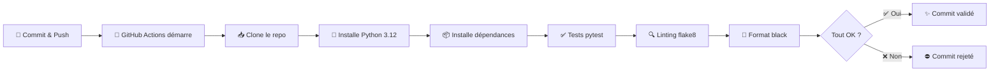

# 💡 Explications professionnelles du pipeline CI/CD

## 📁 Structure du fichier `ci.yml`

Ce fichier définit un **pipeline d'intégration continue** qui s'exécute automatiquement à chaque modification du code.

```yaml
name: CI - Hello CI/CD
on:
  push:
    branches: [ main ]
  pull_request:
    branches: [ main ]
jobs:
  test:
    runs-on: ubuntu-latest
    steps:
      - name: Checkout repository
        uses: actions/checkout@v4
      
      - name: Set up Python
        uses: actions/setup-python@v5
        with:
          python-version: '3.12'
      
      - name: Install dependencies
        run: |
          python -m pip install --upgrade pip
          pip install -r requirements-dev.txt
      
      - name: Run tests with pytest
        run: pytest -v
      
      - name: Run flake8
        run: flake8 app tests
      
      - name: Run black check
        run: black --check app tests
```

------

## 🔍 Décortiquons chaque section

### 1️⃣ **Déclencheurs (Triggers)**

```yaml
on:
  push:
    branches: [ main ]
  pull_request:
    branches: [ main ]
```

- **`push`** : Le pipeline s'exécute à chaque commit poussé sur la branche `main`
- **`pull_request`** : Le pipeline s'exécute aussi quand on crée/met à jour une PR (pull request) vers `main`
- **Pourquoi ?** Valider le code AVANT qu'il n'atteigne la production

------

### 2️⃣ **Environnement d'exécution**

```yaml
jobs:
  test:
    runs-on: ubuntu-latest
```

- **`runs-on: ubuntu-latest`** : GitHub crée une machine virtuelle Ubuntu fraîche
- Chaque exécution démarre avec un environnement propre et isolé
- **Avantage** : Tests reproductibles, pas de "ça marche sur ma machine" 🎯

------

### 3️⃣ **Les étapes (Steps)**

#### 📥 **Étape 1 : Récupération du code**

```yaml
- name: Checkout repository
  uses: actions/checkout@v4
```

- Clone votre dépôt Git dans la machine virtuelle
- Sans ça, GitHub Actions n'aurait pas accès à votre code !

------

#### 🐍 **Étape 2 : Configuration de Python**

```yaml
- name: Set up Python
  uses: actions/setup-python@v5
  with:
    python-version: '3.12'
```

- Installe Python 3.12 sur la machine virtuelle
- **Bonne pratique** : Utiliser la même version qu'en production

------

#### 📦 **Étape 3 : Installation des dépendances**

```yaml
- name: Install dependencies
  run: |
    python -m pip install --upgrade pip
    pip install -r requirements-dev.txt
```

- **`pip install --upgrade pip`** : S'assure d'avoir la dernière version de pip

- `requirements-dev.txt`

   : Installe TOUTES les dépendances :

  - ✅ Dépendances de production (Flask, gunicorn...)
  - ✅ Outils de développement (pytest, flake8, black...)

**💡 Pourquoi `requirements-dev.txt` ?**

```txt
-r requirements.txt    ← Charge d'abord les dépendances de prod
pytest                 ← Puis ajoute les outils de dev
flake8
black
```

------

#### ✅ **Étape 4 : Tests unitaires**

```yaml
- name: Run tests with pytest
  run: pytest -v
```

- **`pytest -v`** : Exécute tous les tests avec mode verbose (détaillé)
- **Si un test échoue** → ❌ Le pipeline s'arrête et le commit est marqué comme "failed"
- **Si tous les tests passent** → ✅ Continue vers les étapes suivantes

------

#### 🔍 **Étape 5 : Vérification du style (Linting)**

```yaml
- name: Run flake8
  run: flake8 app tests
```

- **flake8** : Vérifie que le code respecte les conventions Python (PEP 8)
- Détecte :
  - Lignes trop longues
  - Variables non utilisées
  - Imports inutiles
  - Erreurs de syntaxe subtiles

**Exemple d'erreur détectée :**

```python
# ❌ flake8 va signaler :
def ma_fonction( x,y ):  # Espaces incorrects
    variable_inutilisee = 10
    return x+y  # Manque d'espaces autour de +
```

------

#### 🎨 **Étape 6 : Formatage du code**

```yaml
- name: Run black check
  run: black --check app tests
```

- **black** : Vérificateur de formatage automatique
- **`--check`** : Ne modifie PAS le code, juste vérifie s'il est bien formaté
- **Si le code n'est pas formaté** → ❌ Échec du pipeline

**Pour corriger automatiquement :**

```bash
black app tests  # Sans --check, black reformate directement
```

------

## 🎯 Workflow complet en action



------

## 🛡️ Avantages de cette approche

| Étape      | Protège contre        | Exemple                                               |
| ---------- | --------------------- | ----------------------------------------------------- |
| **pytest** | Bugs et régressions   | Une fonction qui retourne `None` au lieu d'une valeur |
| **flake8** | Code non-maintenable  | Variables non utilisées, imports inutiles             |
| **black**  | Incohérences de style | Équipe avec différents styles de formatage            |

------

## 🚀 Bonnes pratiques appliquées

1. ✅ **Tests automatisés** : Impossible de merger du code cassé
2. ✅ **Qualité de code** : Standards uniformes dans toute l'équipe
3. ✅ **Formatage cohérent** : Plus de débats sur "où mettre les espaces"
4. ✅ **Feedback rapide** : Sait en 15 secondes si le code est valide
5. ✅ **Documentation vivante** : Le pipeline documente les standards attendus

------

## 📊 Résultat sur GitHub

Chaque commit affiche :

- ✅ **Vert** : Tous les checks passent → Prêt pour review/merge
- ❌ **Rouge** : Au moins un check échoue → À corriger avant merge
- 🟡 **Jaune** : Pipeline en cours d'exécution

```less
✅ CI - Hello CI/CD  (15s)
   ✅ test / Checkout repository
   ✅ test / Set up Python
   ✅ test / Install dependencies
   ✅ test / Run tests with pytest
   ✅ test / Run flake8
   ✅ test / Run black check
```

------

**🎓 En résumé** : Ce pipeline transforme votre dépôt en une **usine automatisée** qui vérifie la qualité à chaque modification. C'est la base d'une équipe qui livre du code fiable ! 🚀