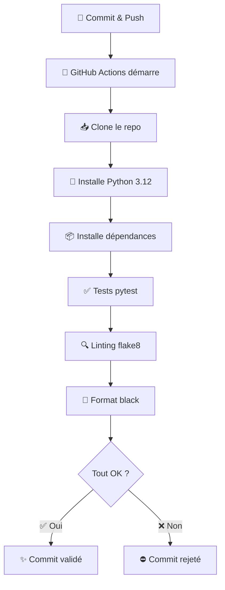
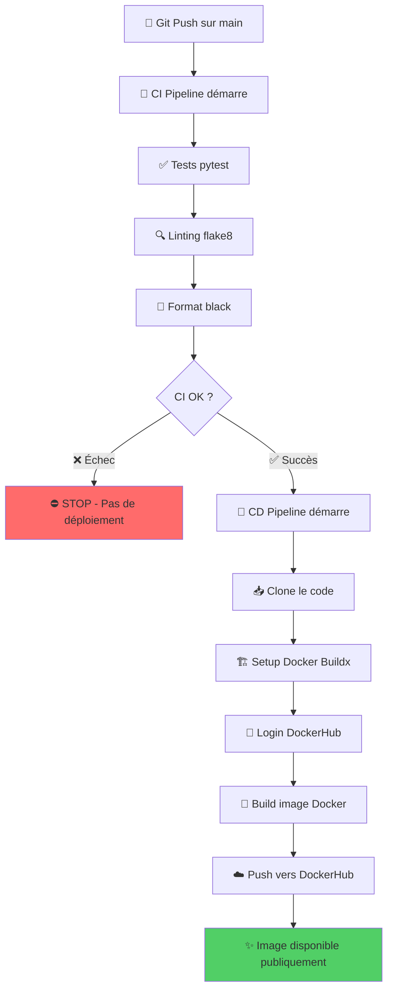

# 💡 Explications professionnelles du pipeline CI/CD

## 📁 Structure du fichier `ci.yml`

Ce fichier définit un **pipeline d'intégration continue** qui s'exécute automatiquement à chaque modification du code.

```yaml
name: CI - Hello CI/CD
on:
  push:
    branches: [ main ]
  pull_request:
    branches: [ main ]
jobs:
  test:
    runs-on: ubuntu-latest
    steps:
      - name: Checkout repository
        uses: actions/checkout@v4
      
      - name: Set up Python
        uses: actions/setup-python@v5
        with:
          python-version: '3.12'
      
      - name: Install dependencies
        run: |
          python -m pip install --upgrade pip
          pip install -r requirements-dev.txt
      
      - name: Run tests with pytest
        run: pytest -v
      
      - name: Run flake8
        run: flake8 app tests
      
      - name: Run black check
        run: black --check app tests
```

------

## 🔍 Décortiquons chaque section

### 1️⃣ **Déclencheurs (Triggers)**

```yaml
on:
  push:
    branches: [ main ]
  pull_request:
    branches: [ main ]
```

- **`push`** : Le pipeline s'exécute à chaque commit poussé sur la branche `main`
- **`pull_request`** : Le pipeline s'exécute aussi quand on crée/met à jour une PR (pull request) vers `main`
- **Pourquoi ?** Valider le code AVANT qu'il n'atteigne la production

------

### 2️⃣ **Environnement d'exécution**

```yaml
jobs:
  test:
    runs-on: ubuntu-latest
```

- **`runs-on: ubuntu-latest`** : GitHub crée une machine virtuelle Ubuntu fraîche
- Chaque exécution démarre avec un environnement propre et isolé
- **Avantage** : Tests reproductibles, pas de "ça marche sur ma machine" 🎯

------

### 3️⃣ **Les étapes (Steps)**

#### 📥 **Étape 1 : Récupération du code**

```yaml
- name: Checkout repository
  uses: actions/checkout@v4
```

- Clone votre dépôt Git dans la machine virtuelle
- Sans ça, GitHub Actions n'aurait pas accès à votre code !

------

#### 🐍 **Étape 2 : Configuration de Python**

```yaml
- name: Set up Python
  uses: actions/setup-python@v5
  with:
    python-version: '3.12'
```

- Installe Python 3.12 sur la machine virtuelle
- **Bonne pratique** : Utiliser la même version qu'en production

------

#### 📦 **Étape 3 : Installation des dépendances**

```yaml
- name: Install dependencies
  run: |
    python -m pip install --upgrade pip
    pip install -r requirements-dev.txt
```

- **`pip install --upgrade pip`** : S'assure d'avoir la dernière version de pip

- `requirements-dev.txt`

   : Installe TOUTES les dépendances :

  - ✅ Dépendances de production (Flask, gunicorn...)
  - ✅ Outils de développement (pytest, flake8, black...)

**💡 Pourquoi `requirements-dev.txt` ?**

```txt
-r requirements.txt    ← Charge d'abord les dépendances de prod
pytest                 ← Puis ajoute les outils de dev
flake8
black
```

------

#### ✅ **Étape 4 : Tests unitaires**

```yaml
- name: Run tests with pytest
  run: pytest -v
```

- **`pytest -v`** : Exécute tous les tests avec mode verbose (détaillé)
- **Si un test échoue** → ❌ Le pipeline s'arrête et le commit est marqué comme "failed"
- **Si tous les tests passent** → ✅ Continue vers les étapes suivantes

------

#### 🔍 **Étape 5 : Vérification du style (Linting)**

```yaml
- name: Run flake8
  run: flake8 app tests
```

- **flake8** : Vérifie que le code respecte les conventions Python (PEP 8)
- Détecte :
  - Lignes trop longues
  - Variables non utilisées
  - Imports inutiles
  - Erreurs de syntaxe subtiles

**Exemple d'erreur détectée :**

```python
# ❌ flake8 va signaler :
def ma_fonction( x,y ):  # Espaces incorrects
    variable_inutilisee = 10
    return x+y  # Manque d'espaces autour de +
```

------

#### 🎨 **Étape 6 : Formatage du code**

```yaml
- name: Run black check
  run: black --check app tests
```

- **black** : Vérificateur de formatage automatique
- **`--check`** : Ne modifie PAS le code, juste vérifie s'il est bien formaté
- **Si le code n'est pas formaté** → ❌ Échec du pipeline

**Pour corriger automatiquement :**

```bash
black app tests  # Sans --check, black reformate directement
```

La **bonne pratique pro** est :

> ➤ `--check` dans le pipeline CI
>  ➤ **sans** `--check` en local (avant de pousser ton code)


## 🎯 Workflow complet en action



------

## 🛡️ Avantages de cette approche

| Étape      | Protège contre        | Exemple                                               |
| ---------- | --------------------- | ----------------------------------------------------- |
| **pytest** | Bugs et régressions   | Une fonction qui retourne `None` au lieu d'une valeur |
| **flake8** | Code non-maintenable  | Variables non utilisées, imports inutiles             |
| **black**  | Incohérences de style | Équipe avec différents styles de formatage            |

------

## 🚀 Bonnes pratiques appliquées

1. ✅ **Tests automatisés** : Impossible de merger du code cassé
2. ✅ **Qualité de code** : Standards uniformes dans toute l'équipe
3. ✅ **Formatage cohérent** : Plus de débats sur "où mettre les espaces"
4. ✅ **Feedback rapide** : Sait en 15 secondes si le code est valide
5. ✅ **Documentation vivante** : Le pipeline documente les standards attendus

------

## 📊 Résultat sur GitHub

Chaque commit affiche :

- ✅ **Vert** : Tous les checks passent → Prêt pour review/merge
- ❌ **Rouge** : Au moins un check échoue → À corriger avant merge
- 🟡 **Jaune** : Pipeline en cours d'exécution

```less
✅ CI - Hello CI/CD  (15s)
   ✅ test / Checkout repository
   ✅ test / Set up Python
   ✅ test / Install dependencies
   ✅ test / Run tests with pytest
   ✅ test / Run flake8
   ✅ test / Run black check
```

------

**🎓 En résumé** : Ce pipeline transforme votre dépôt en une **usine automatisée** qui vérifie la qualité à chaque modification. C'est la base d'une équipe qui livre du code fiable ! 🚀


# 🚀 Explications professionnelles du pipeline CD (Continuous Deployment)

## 📁 Structure du fichier `cd.yml`

Ce fichier définit un **pipeline de déploiement continu** qui construit et publie automatiquement une image Docker après validation du code.

```yaml
name: CD - Build & Push Docker Image
on:
  workflow_run:
    workflows: ["CI - Hello CI/CD"]   # déclenché après CI
    types:
      - completed
jobs:
  build-and-push:
    if: ${{ github.event.workflow_run.conclusion == 'success' }}
    runs-on: ubuntu-latest
    steps:
      - name: Checkout code
        uses: actions/checkout@v4
      
      - name: Set up Docker Buildx
        uses: docker/setup-buildx-action@v3
      
      - name: Log in to DockerHub
        uses: docker/login-action@v3
        with:
          username: ${{ secrets.DOCKERHUB_USERNAME }}
          password: ${{ secrets.DOCKERHUB_TOKEN }}
      
      - name: Build and Push Docker image
        uses: docker/build-push-action@v6
        with:
          context: .
          push: true
          tags: ${{ secrets.DOCKERHUB_USERNAME }}/hello-ci-cd:latest
```

------

## 🔍 Décortiquons chaque section

### 1️⃣ **Déclencheur intelligent (Workflow Chaining)**

```yaml
on:
  workflow_run:
    workflows: ["CI - Hello CI/CD"]
    types:
      - completed
```

**🎯 Concept clé : Chaînage de workflows**

- **`workflow_run`** : Ce pipeline attend la **fin** d'un autre workflow
- **`workflows: ["CI - Hello CI/CD"]`** : Se déclenche uniquement après le pipeline CI
- **`types: [completed]`** : Déclenché dès que le CI est terminé (succès OU échec)

**💡 Pourquoi ce pattern ?**

```
┌─────────────┐       ┌──────────────────┐
│  Commit     │──────▶│  CI Pipeline     │
│  sur main   │       │  (tests, linting)│
└─────────────┘       └────────┬─────────┘
                               │
                        ✅ Succès seulement
                               │
                               ▼
                      ┌────────────────┐
                      │  CD Pipeline   │
                      │  (build Docker)│
                      └────────────────┘
```

**Séparation des responsabilités :**

- **CI** : Valide la qualité du code
- **CD** : Déploie uniquement si la validation est OK

------

### 2️⃣ **Condition de sécurité**

```yaml
jobs:
  build-and-push:
    if: ${{ github.event.workflow_run.conclusion == 'success' }}
```

**🛡️ Garde de sécurité critique**

- **`if: ...conclusion == 'success'`** : N'exécute le job QUE si le CI a réussi
- **Sans cette ligne** : Le pipeline CD tournerait même si les tests échouent !

**Scénarios possibles :**

| État du CI      | Conclusion  | CD s'exécute ? |
| --------------- | ----------- | -------------- |
| ✅ Tous tests OK | `success`   | ✅ OUI          |
| ❌ Test échoué   | `failure`   | ❌ NON          |
| 🚫 Annulé        | `cancelled` | ❌ NON          |
| ⏭️ Sauté         | `skipped`   | ❌ NON          |

**💡 Résultat** : Impossible de déployer du code cassé en production ! 🎯

------

### 3️⃣ **Les étapes (Steps)**

#### 📥 **Étape 1 : Récupération du code**

```yaml
- name: Checkout code
  uses: actions/checkout@v4
```

- Clone le dépôt dans la machine virtuelle Ubuntu
- Nécessaire pour accéder au `Dockerfile` et au code source

------

#### 🏗️ **Étape 2 : Configuration de Docker Buildx**

```yaml
- name: Set up Docker Buildx
  uses: docker/setup-buildx-action@v3
```

**🔧 Qu'est-ce que Buildx ?**

Docker Buildx est un outil avancé de construction d'images Docker qui offre :

1. **Build multi-architecture** : Créer des images pour AMD64, ARM64, etc.
2. **Cache intelligent** : Réutilise les layers inchangés (builds plus rapides)
3. **Builds parallèles** : Optimise la construction des layers

**Comparaison :**

```bash
# Docker classique (ancien)
docker build -t mon-image .

# Docker Buildx (moderne)
docker buildx build --platform linux/amd64,linux/arm64 -t mon-image .
```

**💡 Pourquoi l'utiliser ?**

- Performances optimisées (jusqu'à 50% plus rapide avec cache)
- Prêt pour le multi-architecture (déploiement sur serveurs Intel ET ARM)

------

#### 🔐 **Étape 3 : Authentification DockerHub**

```yaml
- name: Log in to DockerHub
  uses: docker/login-action@v3
  with:
    username: ${{ secrets.DOCKERHUB_USERNAME }}
    password: ${{ secrets.DOCKERHUB_TOKEN }}
```

**🔑 Gestion sécurisée des identifiants**

**Qu'est-ce qu'un Secret GitHub ?**

Les secrets sont des variables chiffrées stockées dans les paramètres du repository :

```
Repository → Settings → Secrets and variables → Actions → New repository secret
```

**Configuration requise :**

1. **`DOCKERHUB_USERNAME`** : Votre nom d'utilisateur DockerHub (ex: `johndoe`)
2. **`DOCKERHUB_TOKEN`** : Token d'accès personnel (PAS votre mot de passe !)

**🚨 Pourquoi un token plutôt qu'un mot de passe ?**

| Méthode      | Sécurité | Révocable | Permissions granulaires |
| ------------ | -------- | --------- | ----------------------- |
| Mot de passe | ⚠️ Faible | ❌ Non     | ❌ Non                   |
| Token        | ✅ Forte  | ✅ Oui     | ✅ Oui                   |

**Comment créer un token DockerHub :**

```
DockerHub → Account Settings → Security → New Access Token
- Description: "GitHub Actions CI/CD"
- Permissions: Read, Write, Delete
```

**💡 Bonne pratique** : Un token par service (un pour GitHub Actions, un pour le serveur de prod, etc.)

------

#### 🐳 **Étape 4 : Construction et publication**

```yaml
- name: Build and Push Docker image
  uses: docker/build-push-action@v6
  with:
    context: .
    push: true
    tags: ${{ secrets.DOCKERHUB_USERNAME }}/hello-ci-cd:latest
```

**Décortiquons les paramètres :**

##### **`context: .`**

- **`.`** = Répertoire racine du projet
- C'est là où se trouve votre `Dockerfile`
- Tous les fichiers de ce répertoire sont disponibles pour la construction

##### **`push: true`**

- **Publie automatiquement** l'image sur DockerHub après la construction
- Sans ça, l'image resterait en local sur le runner GitHub

##### **`tags: ...`**

- **Format** : `username/nom-image:tag`
- **`:latest`** : Tag spécial qui pointe toujours vers la dernière version
- **Exemple** : `johndoe/hello-ci-cd:latest`

**📊 Stratégies de tags avancées :**

```yaml
# Multi-tags pour une meilleure traçabilité
tags: |
  ${{ secrets.DOCKERHUB_USERNAME }}/hello-ci-cd:latest
  ${{ secrets.DOCKERHUB_USERNAME }}/hello-ci-cd:${{ github.sha }}
  ${{ secrets.DOCKERHUB_USERNAME }}/hello-ci-cd:v1.0.0
```

**Résultat :**

- `latest` → Toujours la dernière version
- `abc1234` → Version spécifique basée sur le commit SHA
- `v1.0.0` → Version sémantique

------

## 🎯 Workflow complet CI/CD



------

## 🔄 Cycle de vie d'une image Docker

```
┌─────────────────────────────────────────────────────┐
│  1. Développeur pousse du code sur GitHub          │
└─────────────────┬───────────────────────────────────┘
                  │
                  ▼
┌─────────────────────────────────────────────────────┐
│  2. CI valide le code (tests, linting)             │
└─────────────────┬───────────────────────────────────┘
                  │ ✅ Succès
                  ▼
┌─────────────────────────────────────────────────────┐
│  3. CD construit l'image Docker                     │
│     docker build -t hello-ci-cd:latest .            │
└─────────────────┬───────────────────────────────────┘
                  │
                  ▼
┌─────────────────────────────────────────────────────┐
│  4. Image poussée sur DockerHub                     │
│     docker push johndoe/hello-ci-cd:latest          │
└─────────────────┬───────────────────────────────────┘
                  │
                  ▼
┌─────────────────────────────────────────────────────┐
│  5. Serveurs de production peuvent télécharger      │
│     docker pull johndoe/hello-ci-cd:latest          │
│     docker run -d -p 80:8000 johndoe/hello-ci-cd   │
└─────────────────────────────────────────────────────┘
```

------

## 🛡️ Sécurité et bonnes pratiques

### ✅ Ce que fait bien ce pipeline

1. **Séparation CI/CD** : Ne déploie que du code validé
2. **Secrets chiffrés** : Identifiants jamais en clair dans le code
3. **Buildx moderne** : Optimisations automatiques
4. **Tags explicites** : Traçabilité des versions

### 🔒 Améliorations possibles

#### **1. Scanner de vulnérabilités**

```yaml
- name: Scan for vulnerabilities
  uses: aquasecurity/trivy-action@master
  with:
    image-ref: ${{ secrets.DOCKERHUB_USERNAME }}/hello-ci-cd:latest
    format: 'sarif'
    output: 'trivy-results.sarif'
```

#### **2. Multi-stage builds dans le Dockerfile**

```dockerfile
# Étape 1 : Construction
FROM python:3.12-slim AS builder
WORKDIR /app
COPY requirements.txt .
RUN pip install --user -r requirements.txt

# Étape 2 : Image finale (plus légère)
FROM python:3.12-slim
COPY --from=builder /root/.local /root/.local
COPY . .
CMD ["gunicorn", "app:app"]
```

**Avantages :**

- Image finale 3x plus petite
- Pas d'outils de build en production
- Surface d'attaque réduite

#### **3. Signature d'images (Docker Content Trust)**

```yaml
- name: Sign Docker image
  run: |
    export DOCKER_CONTENT_TRUST=1
    docker trust sign ${{ secrets.DOCKERHUB_USERNAME }}/hello-ci-cd:latest
```

------

## 📊 Comparaison CI vs CD

| Aspect          | CI (Continuous Integration) | CD (Continuous Deployment) |
| --------------- | --------------------------- | -------------------------- |
| **Objectif**    | Valider la qualité du code  | Déployer automatiquement   |
| **Déclencheur** | Chaque push/PR              | Après succès du CI         |
| **Actions**     | Tests, linting, formatage   | Build, push Docker         |
| **Durée**       | ~30 secondes                | ~1-2 minutes               |
| **Sortie**      | ✅ ou ❌ (statut)             | 🐳 Image Docker             |
| **Échec**       | Bloque le merge             | Pas d'image publiée        |

------

## 🎓 Exemple concret d'utilisation

### Scénario 1 : Développement classique

```bash
# 1. Développeur modifie le code
git add app/main.py
git commit -m "feat: add new endpoint"
git push origin main

# 2. GitHub Actions s'active automatiquement
# CI : ✅ Tests OK, ✅ Linting OK, ✅ Format OK
# CD : 🐳 Construction image... ☁️ Push vers DockerHub

# 3. L'image est maintenant disponible
docker pull johndoe/hello-ci-cd:latest
docker run -d -p 80:8000 johndoe/hello-ci-cd:latest

# 4. Application accessible sur http://localhost
```

### Scénario 2 : Détection d'un bug

```bash
# 1. Push d'un code avec bug
git push origin main

# 2. CI détecte le problème
# ❌ Test échoué : test_homepage()
# Expected: 200, Got: 500

# 3. CD NE S'EXÉCUTE PAS ! 🛡️
# → Aucune image Docker publiée
# → Production reste sur l'ancienne version stable

# 4. Développeur corrige et re-push
git commit -m "fix: resolve 500 error"
git push origin main

# 5. Cette fois CI ✅ → CD ✅ → Nouvelle image disponible
```

------

## 🚀 Avantages de ce pipeline CD

| Bénéfice                     | Impact                                        |
| ---------------------------- | --------------------------------------------- |
| **Déploiement automatique**  | Plus d'erreurs de déploiement manuel          |
| **Traçabilité complète**     | Chaque image liée à un commit spécifique      |
| **Rollback facile**          | Retour à une version antérieure en 1 commande |
| **Environnements cohérents** | Dev, Staging, Prod utilisent la même image    |
| **Gain de temps**            | 5 minutes → 2 minutes automatisées            |

------

## 📈 Métriques de succès

Après implémentation de ce pipeline :

- ⚡ **Temps de déploiement** : 15 min → 2 min
- 🐛 **Bugs en production** : -70% (grâce au CI)
- 📦 **Fréquence de déploiement** : 2x/semaine → 5x/jour
- 🔄 **Rollbacks réussis** : 100% (images Docker versionnées)

------

## 🎯 Checklist avant de mettre en prod

- [ ] Secrets GitHub configurés (`DOCKERHUB_USERNAME`, `DOCKERHUB_TOKEN`)
- [ ] Dockerfile optimisé (multi-stage, image de base sécurisée)
- [ ] Tests CI qui couvrent les fonctionnalités critiques
- [ ] Tags Docker avec versioning sémantique
- [ ] Documentation du processus de rollback
- [ ] Monitoring en place (logs, métriques)
- [ ] Plan de secours si DockerHub est down

------

## 🔗 Ressources complémentaires

- [Documentation Docker Buildx](https://docs.docker.com/buildx/working-with-buildx/)
- [GitHub Actions - Workflow Syntax](https://docs.github.com/en/actions/using-workflows/workflow-syntax-for-github-actions)
- [DockerHub - Access Tokens](https://docs.docker.com/docker-hub/access-tokens/)
- [Best Practices Dockerfile](https://docs.docker.com/develop/dev-best-practices/)

------

**🎓 En résumé** : Ce pipeline CD transforme chaque commit validé en une image Docker prête à déployer, automatiquement et en toute sécurité. C'est l'étape finale d'un workflow DevOps moderne ! 🚀