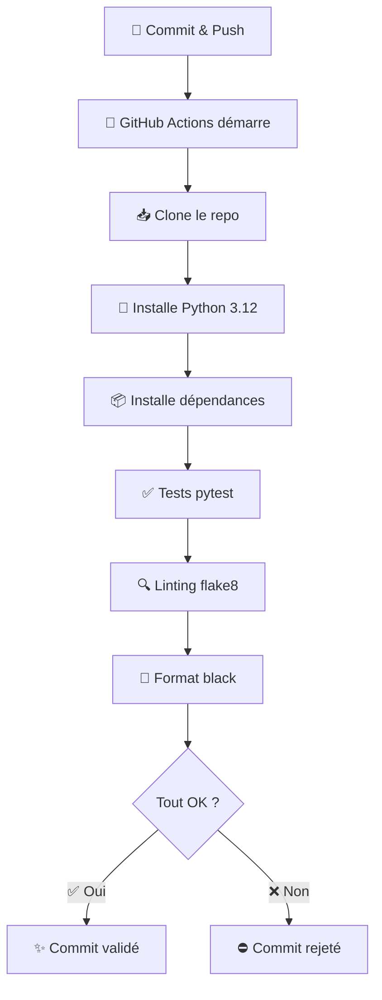
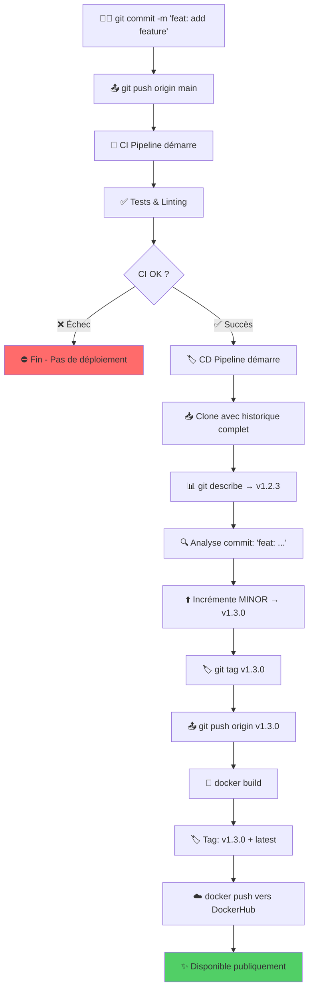

# 💡 Explications professionnelles du pipeline CI/CD

## 📁 Structure du fichier `ci.yml`

Ce fichier définit un **pipeline d'intégration continue** qui s'exécute automatiquement à chaque modification du code.

```yaml
name: CI - Hello CI/CD
on:
  push:
    branches: [ main ]
  pull_request:
    branches: [ main ]
jobs:
  test:
    runs-on: ubuntu-latest
    steps:
      - name: Checkout repository
        uses: actions/checkout@v4
      
      - name: Set up Python
        uses: actions/setup-python@v5
        with:
          python-version: '3.12'
      
      - name: Install dependencies
        run: |
          python -m pip install --upgrade pip
          pip install -r requirements-dev.txt
      
      - name: Run tests with pytest
        run: pytest -v
      
      - name: Run flake8
        run: flake8 app tests
      
      - name: Run black check
        run: black --check app tests
```

------

## 🔍 Décortiquons chaque section

### 1️⃣ **Déclencheurs (Triggers)**

```yaml
on:
  push:
    branches: [ main ]
  pull_request:
    branches: [ main ]
```

- **`push`** : Le pipeline s'exécute à chaque commit poussé sur la branche `main`
- **`pull_request`** : Le pipeline s'exécute aussi quand on crée/met à jour une PR (pull request) vers `main`
- **Pourquoi ?** Valider le code AVANT qu'il n'atteigne la production

------

### 2️⃣ **Environnement d'exécution**

```yaml
jobs:
  test:
    runs-on: ubuntu-latest
```

- **`runs-on: ubuntu-latest`** : GitHub crée une machine virtuelle Ubuntu fraîche
- Chaque exécution démarre avec un environnement propre et isolé
- **Avantage** : Tests reproductibles, pas de "ça marche sur ma machine" 🎯

------

### 3️⃣ **Les étapes (Steps)**

#### 📥 **Étape 1 : Récupération du code**

```yaml
- name: Checkout repository
  uses: actions/checkout@v4
```

- Clone votre dépôt Git dans la machine virtuelle
- Sans ça, GitHub Actions n'aurait pas accès à votre code !

------

#### 🐍 **Étape 2 : Configuration de Python**

```yaml
- name: Set up Python
  uses: actions/setup-python@v5
  with:
    python-version: '3.12'
```

- Installe Python 3.12 sur la machine virtuelle
- **Bonne pratique** : Utiliser la même version qu'en production

------

#### 📦 **Étape 3 : Installation des dépendances**

```yaml
- name: Install dependencies
  run: |
    python -m pip install --upgrade pip
    pip install -r requirements-dev.txt
```

- **`pip install --upgrade pip`** : S'assure d'avoir la dernière version de pip

- `requirements-dev.txt`

   : Installe TOUTES les dépendances :

  - ✅ Dépendances de production (Flask, gunicorn...)
  - ✅ Outils de développement (pytest, flake8, black...)

**💡 Pourquoi `requirements-dev.txt` ?**

```txt
-r requirements.txt    ← Charge d'abord les dépendances de prod
pytest                 ← Puis ajoute les outils de dev
flake8
black
```

------

#### ✅ **Étape 4 : Tests unitaires**

```yaml
- name: Run tests with pytest
  run: pytest -v
```

- **`pytest -v`** : Exécute tous les tests avec mode verbose (détaillé)
- **Si un test échoue** → ❌ Le pipeline s'arrête et le commit est marqué comme "failed"
- **Si tous les tests passent** → ✅ Continue vers les étapes suivantes

------

#### 🔍 **Étape 5 : Vérification du style (Linting)**

```yaml
- name: Run flake8
  run: flake8 app tests
```

- **flake8** : Vérifie que le code respecte les conventions Python (PEP 8)
- Détecte :
  - Lignes trop longues
  - Variables non utilisées
  - Imports inutiles
  - Erreurs de syntaxe subtiles

**Exemple d'erreur détectée :**

```python
# ❌ flake8 va signaler :
def ma_fonction( x,y ):  # Espaces incorrects
    variable_inutilisee = 10
    return x+y  # Manque d'espaces autour de +
```

------

#### 🎨 **Étape 6 : Formatage du code**

```yaml
- name: Run black check
  run: black --check app tests
```

- **black** : Vérificateur de formatage automatique
- **`--check`** : Ne modifie PAS le code, juste vérifie s'il est bien formaté
- **Si le code n'est pas formaté** → ❌ Échec du pipeline

**Pour corriger automatiquement :**

```bash
black app tests  # Sans --check, black reformate directement
```

La **bonne pratique pro** est :

> ➤ `--check` dans le pipeline CI
>  ➤ **sans** `--check` en local (avant de pousser ton code)


## 🎯 Workflow complet en action



------

## 🛡️ Avantages de cette approche

| Étape      | Protège contre        | Exemple                                               |
| ---------- | --------------------- | ----------------------------------------------------- |
| **pytest** | Bugs et régressions   | Une fonction qui retourne `None` au lieu d'une valeur |
| **flake8** | Code non-maintenable  | Variables non utilisées, imports inutiles             |
| **black**  | Incohérences de style | Équipe avec différents styles de formatage            |

------

## 🚀 Bonnes pratiques appliquées

1. ✅ **Tests automatisés** : Impossible de merger du code cassé
2. ✅ **Qualité de code** : Standards uniformes dans toute l'équipe
3. ✅ **Formatage cohérent** : Plus de débats sur "où mettre les espaces"
4. ✅ **Feedback rapide** : Sait en 15 secondes si le code est valide
5. ✅ **Documentation vivante** : Le pipeline documente les standards attendus

------

## 📊 Résultat sur GitHub

Chaque commit affiche :

- ✅ **Vert** : Tous les checks passent → Prêt pour review/merge
- ❌ **Rouge** : Au moins un check échoue → À corriger avant merge
- 🟡 **Jaune** : Pipeline en cours d'exécution

```less
✅ CI - Hello CI/CD  (15s)
   ✅ test / Checkout repository
   ✅ test / Set up Python
   ✅ test / Install dependencies
   ✅ test / Run tests with pytest
   ✅ test / Run flake8
   ✅ test / Run black check
```

------

**🎓 En résumé** : Ce pipeline transforme votre dépôt en une **usine automatisée** qui vérifie la qualité à chaque modification. C'est la base d'une équipe qui livre du code fiable ! 🚀


# 💡 Explication complète du pipeline CD avec versioning automatique

## 📋 Vue d'ensemble

Ce pipeline CD est une **version évoluée** qui ajoute une fonctionnalité cruciale : **le versioning sémantique automatique**. Au lieu de simplement publier une image `latest`, il crée automatiquement des versions numérotées (v1.0.0, v1.1.0, etc.) basées sur vos commits.


## 📁 Structure du fichier `cd.yml`

```yaml
name: CD - Build, Tag & Push Docker Image

on:
  workflow_run:
    workflows: ["CI - Hello CI/CD"]
    types: [completed]

permissions:
  contents: write

jobs:
  build-tag-push:
    if: ${{ github.event.workflow_run.conclusion == 'success' }}
    runs-on: ubuntu-latest

    steps:
      - name: Checkout repository
        uses: actions/checkout@v4
        with:
          fetch-depth: 0  # nécessaire pour les tags Git

      - name: Set up Docker Buildx
        uses: docker/setup-buildx-action@v3

      - name: Get current version
        id: get_version
        run: |
          VERSION=$(git describe --tags --abbrev=0 2>/dev/null || echo "v0.0.0")
          echo "Current version: $VERSION"
          echo "version=$VERSION" >> $GITHUB_OUTPUT

      - name: Detect commit type and bump version
        id: bump_version
        run: |
          COMMIT_MSG=$(git log -1 --pretty=%B)
          echo "Last commit: $COMMIT_MSG"

          MAJOR=$(echo "${{ steps.get_version.outputs.version }}" | cut -d. -f1 | tr -d 'v')
          MINOR=$(echo "${{ steps.get_version.outputs.version }}" | cut -d. -f2)
          PATCH=$(echo "${{ steps.get_version.outputs.version }}" | cut -d. -f3)

          if [[ "$COMMIT_MSG" == *"BREAKING CHANGE"* ]]; then
            MAJOR=$((MAJOR + 1)); MINOR=0; PATCH=0
          elif [[ "$COMMIT_MSG" == feat:* ]]; then
            MINOR=$((MINOR + 1)); PATCH=0
          else
            PATCH=$((PATCH + 1))
          fi

          NEW_VERSION="v${MAJOR}.${MINOR}.${PATCH}"
          echo "New version: $NEW_VERSION"
          echo "new_version=$NEW_VERSION" >> $GITHUB_OUTPUT

      - name: Create and push new Git tag
        env:
          GITHUB_TOKEN: ${{ secrets.GITHUB_TOKEN }}
        run: |
          git config user.name "${{ github.actor }}"
          git config user.email "${{ github.actor }}@users.noreply.github.com"
          git tag ${{ steps.bump_version.outputs.new_version }}
          git push origin ${{ steps.bump_version.outputs.new_version }}

      - name: Log in to DockerHub
        uses: docker/login-action@v3
        with:
          username: ${{ secrets.DOCKERHUB_USERNAME }}
          password: ${{ secrets.DOCKERHUB_TOKEN }}

      - name: Build & Push Docker image with version tag
        uses: docker/build-push-action@v6
        with:
          context: .
          push: true
          tags: |
            ${{ secrets.DOCKERHUB_USERNAME }}/hello-ci-cd:${{ steps.bump_version.outputs.new_version }}
            ${{ secrets.DOCKERHUB_USERNAME }}/hello-ci-cd:latest
```


------

## 🎯 Ce que fait ce pipeline en résumé

```
1. ✅ Attend que le CI réussisse
2. 📊 Lit la dernière version Git (ex: v1.2.3)
3. 🔍 Analyse le message du dernier commit
4. ⬆️ Incrémente automatiquement la version selon les règles
5. 🏷️ Crée un nouveau tag Git (ex: v1.2.4)
6. 🐳 Construit l'image Docker avec 2 tags :
   - hello-ci-cd:v1.2.4 (version spécifique)
   - hello-ci-cd:latest (toujours la dernière)
7. ☁️ Publie tout sur DockerHub
```

------

## 📄 Décortiquons le code section par section

### 1️⃣ En-tête et déclencheur

```yaml
name: CD - Build, Tag & Push Docker Image
on:
  workflow_run:
    workflows: ["CI - Hello CI/CD"]
    types: [completed]
```

**Identique à l'ancienne version** : Se déclenche après la complétion du workflow CI.

------

### 2️⃣ Permissions spéciales

```yaml
permissions:
  contents: write
```

**🔑 Nouveau : Permission d'écriture**

- **`contents: write`** : Autorise le workflow à **modifier le dépôt Git**
- **Pourquoi ?** Pour créer et pousser des tags Git automatiquement
- **Sans cette ligne** : Erreur `Permission denied` lors du push du tag

**📊 Niveaux de permissions GitHub Actions :**

| Permission        | Lecture | Écriture | Usage                      |
| ----------------- | ------- | -------- | -------------------------- |
| `contents: read`  | ✅       | ❌        | Clone le code (par défaut) |
| `contents: write` | ✅       | ✅        | Clone + push tags/branches |

------

### 3️⃣ Job principal

```yaml
jobs:
  build-tag-push:
    if: ${{ github.event.workflow_run.conclusion == 'success' }}
    runs-on: ubuntu-latest
```

**Garde de sécurité** : N'exécute le job QUE si le CI a réussi (comme avant).

------

### 4️⃣ Étape 1 : Clone avec historique complet

```yaml
steps:
  - name: Checkout repository
    uses: actions/checkout@v4
    with:
      fetch-depth: 0  # nécessaire pour les tags Git
```

**🔍 Différence critique : `fetch-depth: 0`**

#### Comparaison :

| Sans `fetch-depth: 0`              | Avec `fetch-depth: 0`           |
| ---------------------------------- | ------------------------------- |
| Clone uniquement le dernier commit | Clone **tout l'historique Git** |
| ❌ Pas d'accès aux tags             | ✅ Accès à tous les tags         |
| ❌ `git describe` échoue            | ✅ `git describe` fonctionne     |

**💡 Pourquoi c'est nécessaire ?**

```bash
# Sans fetch-depth: 0
git describe --tags --abbrev=0
# Erreur : fatal: No names found, cannot describe anything.

# Avec fetch-depth: 0
git describe --tags --abbrev=0
# Résultat : v1.2.3
```

**🎯 Analogie :**

- Sans : Vous ouvrez un livre à la dernière page uniquement
- Avec : Vous avez le livre complet et pouvez lire l'index

------

### 5️⃣ Étape 2 : Configuration de Docker Buildx

```yaml
- name: Set up Docker Buildx
  uses: docker/setup-buildx-action@v3
```

**Identique à l'ancienne version** : Configure l'outil moderne de build Docker.

------

### 6️⃣ Étape 3 : Récupération de la version actuelle

```yaml
- name: Get current version
  id: get_version
  run: |
    VERSION=$(git describe --tags --abbrev=0 2>/dev/null || echo "v0.0.0")
    echo "Current version: $VERSION"
    echo "version=$VERSION" >> $GITHUB_OUTPUT
```

**🔍 Analyse ligne par ligne :**

#### **Ligne 1 : Récupération du dernier tag**

```bash
VERSION=$(git describe --tags --abbrev=0 2>/dev/null || echo "v0.0.0")
```

**Décortiquons cette commande complexe :**

| Partie                | Signification                              | Exemple          |
| --------------------- | ------------------------------------------ | ---------------- |
| `git describe --tags` | Trouve le tag le plus récent               | v1.2.3-5-gabc123 |
| `--abbrev=0`          | Affiche uniquement le tag, pas le hash     | v1.2.3           |
| `2>/dev/null`         | Supprime les erreurs (si aucun tag existe) | (silencieux)     |
| `|| echo "v0.0.0"`    | Si échec, utilise v0.0.0 par défaut        | v0.0.0           |

**📊 Scénarios possibles :**

```bash
# Scénario 1 : Premier déploiement (aucun tag)
$ git describe --tags --abbrev=0
fatal: No names found
$ VERSION = "v0.0.0"  # Valeur par défaut

# Scénario 2 : Déploiements précédents existent
$ git describe --tags --abbrev=0
v1.2.3
$ VERSION = "v1.2.3"
```

#### **Ligne 2 : Affichage pour debug**

```bash
echo "Current version: $VERSION"
```

Affiche dans les logs GitHub Actions : `Current version: v1.2.3`

#### **Ligne 3 : Exportation vers les autres étapes**

```bash
echo "version=$VERSION" >> $GITHUB_OUTPUT
```

**🔑 Mécanisme GitHub Actions : Partage de données entre steps**

```
┌─────────────────────┐
│  Step 1: get_version│
│  OUTPUT: v1.2.3     │
└──────────┬──────────┘
           │
           ▼
┌─────────────────────┐
│  Step 2: bump_version│
│  INPUT: v1.2.3      │
└─────────────────────┘
```

**Syntaxe d'utilisation :**

```yaml
# Définir une sortie
echo "ma_variable=valeur" >> $GITHUB_OUTPUT

# Utiliser dans un autre step
${{ steps.get_version.outputs.ma_variable }}
```

------

### 7️⃣ Étape 4 : Détection du type de commit et incrémentation

```yaml
- name: Detect commit type and bump version
  id: bump_version
  run: |
    COMMIT_MSG=$(git log -1 --pretty=%B)
    echo "Last commit: $COMMIT_MSG"
    
    MAJOR=$(echo "${{ steps.get_version.outputs.version }}" | cut -d. -f1 | tr -d 'v')
    MINOR=$(echo "${{ steps.get_version.outputs.version }}" | cut -d. -f2)
    PATCH=$(echo "${{ steps.get_version.outputs.version }}" | cut -d. -f3)
    
    if [[ "$COMMIT_MSG" == *"BREAKING CHANGE"* ]]; then
      MAJOR=$((MAJOR + 1)); MINOR=0; PATCH=0
    elif [[ "$COMMIT_MSG" == feat:* ]]; then
      MINOR=$((MINOR + 1)); PATCH=0
    else
      PATCH=$((PATCH + 1))
    fi
    
    NEW_VERSION="v${MAJOR}.${MINOR}.${PATCH}"
    echo "New version: $NEW_VERSION"
    echo "new_version=$NEW_VERSION" >> $GITHUB_OUTPUT
```

**🎯 C'est le cœur du système de versioning ! Analysons en détail.**

------

#### **A. Récupération du message du dernier commit**

```bash
COMMIT_MSG=$(git log -1 --pretty=%B)
echo "Last commit: $COMMIT_MSG"
```

**Commande `git log` expliquée :**

| Option        | Signification                        | Exemple          |
| ------------- | ------------------------------------ | ---------------- |
| `-1`          | Affiche uniquement le dernier commit | (le plus récent) |
| `--pretty=%B` | Format d'affichage : message complet | feat: add login  |

**Exemple concret :**

```bash
# Historique Git
$ git log --oneline
abc1234 feat: add user authentication
def5678 fix: resolve memory leak
ghi9012 docs: update README

# Commande exécutée
$ git log -1 --pretty=%B
feat: add user authentication
```

------

#### **B. Découpage de la version actuelle**

```bash
MAJOR=$(echo "${{ steps.get_version.outputs.version }}" | cut -d. -f1 | tr -d 'v')
MINOR=$(echo "${{ steps.get_version.outputs.version }}" | cut -d. -f2)
PATCH=$(echo "${{ steps.get_version.outputs.version }}" | cut -d. -f3)
```

**🔧 Pipeline de traitement Unix :**

Prenons l'exemple avec la version `v1.2.3` :

```bash
# Étape par étape pour MAJOR :
echo "v1.2.3"           # Input
| cut -d. -f1           # Découpe sur '.' et prend le 1er champ → "v1"
| tr -d 'v'             # Supprime le 'v' → "1"
# Résultat : MAJOR = 1

# Pour MINOR :
echo "v1.2.3"
| cut -d. -f2           # Prend le 2ème champ → "2"
# Résultat : MINOR = 2

# Pour PATCH :
echo "v1.2.3"
| cut -d. -f3           # Prend le 3ème champ → "3"
# Résultat : PATCH = 3
```

**📊 Tableau de découpage :**

| Version | MAJOR | MINOR | PATCH |
| ------- | ----- | ----- | ----- |
| v1.2.3  | 1     | 2     | 3     |
| v2.0.15 | 2     | 0     | 15    |
| v0.1.0  | 0     | 1     | 0     |

------

#### **C. Versioning sémantique (Semantic Versioning)**

**🎓 Qu'est-ce que le SemVer ?**

Format : `MAJOR.MINOR.PATCH` (ex: 2.3.1)

| Composant | Quand incrémenter                            | Exemple de changement                                      |
| --------- | -------------------------------------------- | ---------------------------------------------------------- |
| **MAJOR** | Changements incompatibles (breaking changes) | Suppression d'une API, changement de signature de fonction |
| **MINOR** | Nouvelles fonctionnalités compatibles        | Ajout d'un endpoint, nouvelle classe                       |
| **PATCH** | Corrections de bugs                          | Fix d'un bug, typo dans les logs                           |

------

#### **D. Logique d'incrémentation intelligente**

```bash
if [[ "$COMMIT_MSG" == *"BREAKING CHANGE"* ]]; then
  MAJOR=$((MAJOR + 1)); MINOR=0; PATCH=0
elif [[ "$COMMIT_MSG" == feat:* ]]; then
  MINOR=$((MINOR + 1)); PATCH=0
else
  PATCH=$((PATCH + 1))
fi
```

**🔍 Analyse des conditions :**

##### **Condition 1 : BREAKING CHANGE**

```bash
if [[ "$COMMIT_MSG" == *"BREAKING CHANGE"* ]]; then
```

**Détection :**

- Recherche la chaîne `"BREAKING CHANGE"` **n'importe où** dans le message
- `*` = wildcard (joker) en Bash

**Exemples de commits détectés :**

```
✅ "feat: new API BREAKING CHANGE: removed /old endpoint"
✅ "BREAKING CHANGE: switched to Python 3.12"
❌ "feat: add new feature" (pas de BREAKING CHANGE)
```

**Action :**

```bash
MAJOR=$((MAJOR + 1))  # Incrémente MAJOR
MINOR=0               # Réinitialise MINOR
PATCH=0               # Réinitialise PATCH
```

**Exemple :**

```
Avant : v1.2.3
Commit : "BREAKING CHANGE: API v2"
Après : v2.0.0
```

------

##### **Condition 2 : feat: (nouvelle fonctionnalité)**

```bash
elif [[ "$COMMIT_MSG" == feat:* ]]; then
```

**Détection :**

- Message commence par `"feat:"` (convention Conventional Commits)
- `*` après = n'importe quoi peut suivre

**Exemples :**

```
✅ "feat: add user login"
✅ "feat: implement caching"
❌ "fix: login bug" (commence par "fix:", pas "feat:")
```

**Action :**

```bash
MINOR=$((MINOR + 1))  # Incrémente MINOR
PATCH=0               # Réinitialise PATCH
```

**Exemple :**

```
Avant : v1.2.3
Commit : "feat: add dark mode"
Après : v1.3.0
```

------

##### **Condition 3 : Tout le reste (else)**

```bash
else
  PATCH=$((PATCH + 1))
fi
```

**Cas couverts :**

- `fix:` (corrections de bugs)
- `docs:` (documentation)
- `chore:` (tâches diverses)
- `refactor:` (refactoring sans changement fonctionnel)
- Tout message sans préfixe

**Action :**

```bash
PATCH=$((PATCH + 1))  # Incrémente uniquement PATCH
```

**Exemple :**

```
Avant : v1.2.3
Commit : "fix: resolve login issue"
Après : v1.2.4
```

------

#### **E. Construction de la nouvelle version**

```bash
NEW_VERSION="v${MAJOR}.${MINOR}.${PATCH}"
echo "New version: $NEW_VERSION"
echo "new_version=$NEW_VERSION" >> $GITHUB_OUTPUT
```

**Assemblage final :**

```bash
# Si MAJOR=1, MINOR=3, PATCH=0
NEW_VERSION="v${1}.${3}.${0}"  # → "v1.3.0"
```

------

### 📊 Tableau récapitulatif des incrémentations

| Message de commit             | Version actuelle | Nouvelle version | Règle appliquée     |
| ----------------------------- | ---------------- | ---------------- | ------------------- |
| `BREAKING CHANGE: remove API` | v1.2.3           | v2.0.0           | MAJOR + reset       |
| `feat: add notifications`     | v1.2.3           | v1.3.0           | MINOR + reset PATCH |
| `fix: typo in logs`           | v1.2.3           | v1.2.4           | PATCH               |
| `docs: update README`         | v1.2.3           | v1.2.4           | PATCH (else)        |
| `chore: update deps`          | v1.2.3           | v1.2.4           | PATCH (else)        |

------

### 8️⃣ Étape 5 : Création et push du tag Git

```yaml
- name: Create and push new Git tag
  env:
    GITHUB_TOKEN: ${{ secrets.GITHUB_TOKEN }}
  run: |
    git config user.name "${{ github.actor }}"
    git config user.email "${{ github.actor }}@users.noreply.github.com"
    git tag ${{ steps.bump_version.outputs.new_version }}
    git push origin ${{ steps.bump_version.outputs.new_version }}
```

**🔍 Analyse détaillée :**

#### **A. Configuration du token d'authentification**

```yaml
env:
  GITHUB_TOKEN: ${{ secrets.GITHUB_TOKEN }}
```

**🔑 Secret automatique de GitHub Actions**

- **`GITHUB_TOKEN`** : Token généré automatiquement pour chaque workflow
- **Pas besoin de le créer** : GitHub le fournit gratuitement
- **Permissions** : Définies par `permissions: contents: write` (voir début)

------

#### **B. Configuration de l'identité Git**

```bash
git config user.name "${{ github.actor }}"
git config user.email "${{ github.actor }}@users.noreply.github.com"
```

**📝 Variables GitHub Actions utilisées :**

| Variable              | Signification                                 | Exemple   |
| --------------------- | --------------------------------------------- | --------- |
| `${{ github.actor }}` | Nom d'utilisateur qui a déclenché le workflow | `johndoe` |

**Résultat :**

```bash
git config user.name "johndoe"
git config user.email "johndoe@users.noreply.github.com"
```

**💡 Pourquoi l'email `@users.noreply.github.com` ?**

- Email spécial GitHub qui protège votre vraie adresse email
- Visible publiquement dans l'historique Git sans exposer votre email personnel

------

#### **C. Création du tag Git**

```bash
git tag ${{ steps.bump_version.outputs.new_version }}
```

**Exemple :**

```bash
git tag v1.3.0
```

**📌 Qu'est-ce qu'un tag Git ?**

- Un **pointeur nommé** vers un commit spécifique
- Immuable (ne peut pas être déplacé facilement)
- Utilisé pour marquer les versions importantes

**Visualisation :**

```
main: abc1234 ← def5678 ← ghi9012
                          ↑
                        v1.3.0 (tag)
```

------

#### **D. Push du tag vers GitHub**

```bash
git push origin ${{ steps.bump_version.outputs.new_version }}
```

**Exemple :**

```bash
git push origin v1.3.0
```

**🌐 Où apparaît le tag ?**

```
GitHub Repository → Releases → Tags
```

**📊 Avantages des tags Git :**

| Bénéfice             | Description                                       |
| -------------------- | ------------------------------------------------- |
| **Traçabilité**      | Associe une version à un commit précis            |
| **Rollback facile**  | `git checkout v1.2.3` pour revenir en arrière     |
| **Releases GitHub**  | Crée automatiquement une release dans l'UI GitHub |
| **Versioning clair** | Historique des versions lisible par tous          |

------

### 9️⃣ Étape 6 : Connexion à DockerHub

```yaml
- name: Log in to DockerHub
  uses: docker/login-action@v3
  with:
    username: ${{ secrets.DOCKERHUB_USERNAME }}
    password: ${{ secrets.DOCKERHUB_TOKEN }}
```

**Identique à l'ancienne version** : Authentification avec secrets GitHub.

------

### 🔟 Étape 7 : Build et push de l'image Docker

```yaml
- name: Build & Push Docker image with version tag
  uses: docker/build-push-action@v6
  with:
    context: .
    push: true
    tags: |
      ${{ secrets.DOCKERHUB_USERNAME }}/hello-ci-cd:${{ steps.bump_version.outputs.new_version }}
      ${{ secrets.DOCKERHUB_USERNAME }}/hello-ci-cd:latest
```

**🎯 La grande différence : Multi-tagging**

#### **Avant (ancienne version) :**

```yaml
tags: ${{ secrets.DOCKERHUB_USERNAME }}/hello-ci-cd:latest
```

**Résultat :**

- Une seule image : `johndoe/hello-ci-cd:latest`

#### **Maintenant (nouvelle version) :**

```yaml
tags: |
  ${{ secrets.DOCKERHUB_USERNAME }}/hello-ci-cd:${{ steps.bump_version.outputs.new_version }}
  ${{ secrets.DOCKERHUB_USERNAME }}/hello-ci-cd:latest
```

**Résultat :**

- Deux tags pour la 

  même image

   :

  - `johndoe/hello-ci-cd:v1.3.0` (version spécifique)
  - `johndoe/hello-ci-cd:latest` (toujours la dernière)

------

## 🎬 Exemple concret de flux complet

### Scénario : Ajout d'une nouvelle fonctionnalité

```bash
# 1️⃣ Développeur crée une feature
git add app/new_feature.py
git commit -m "feat: add user dashboard"
git push origin main

# 2️⃣ CI s'exécute (tests, linting) ✅

# 3️⃣ CD démarre automatiquement

# Étape A : Récupère la version actuelle
$ git describe --tags --abbrev=0
v1.2.3

# Étape B : Analyse le commit
$ git log -1 --pretty=%B
feat: add user dashboard

# Étape C : Détecte "feat:" → Incrémente MINOR
Avant : v1.2.3
Après : v1.3.0

# Étape D : Crée le tag Git
$ git tag v1.3.0
$ git push origin v1.3.0
✅ Tag visible sur GitHub

# Étape E : Build Docker avec 2 tags
Building image...
Tagging as johndoe/hello-ci-cd:v1.3.0
Tagging as johndoe/hello-ci-cd:latest
Pushing to DockerHub... ✅

# 4️⃣ Résultat final sur DockerHub :
johndoe/hello-ci-cd:v1.3.0 (nouveau)
johndoe/hello-ci-cd:v1.2.3 (toujours disponible)
johndoe/hello-ci-cd:latest (pointe vers v1.3.0)
```

------

## 📊 Comparaison Ancien vs Nouveau Pipeline

| Aspect                 | Ancien Pipeline                             | Nouveau Pipeline (avec versioning)              |
| ---------------------- | ------------------------------------------- | ----------------------------------------------- |
| **Tags Docker**        | Uniquement `latest`                         | `latest` + version (ex: `v1.3.0`)               |
| **Tags Git**           | ❌ Aucun                                     | ✅ Créés automatiquement                         |
| **Traçabilité**        | ⚠️ Difficile (quand a été déployé latest ?)  | ✅ Excellente (v1.3.0 = commit abc1234)          |
| **Rollback**           | ⚠️ Compliqué (quel commit récupérer ?)       | ✅ Facile (`docker pull :v1.2.3`)                |
| **Historique**         | ❌ Impossible de voir les anciennes versions | ✅ Toutes les versions disponibles sur DockerHub |
| **Convention commits** | ❌ Pas nécessaire                            | ✅ Recommandée (feat:, fix:, etc.)               |
| **Permissions GitHub** | `contents: read` (défaut)                   | `contents: write` (modification repo)           |

------

## 🎯 Avantages du versioning sémantique automatique

### 1. **Traçabilité totale**

```bash
# Avant : "On a un bug en prod, c'était quelle version ?"
# → Impossible de savoir

# Maintenant :
$ docker inspect johndoe/hello-ci-cd:v1.3.0
# → Commit SHA : abc1234
# → Date exacte de build
# → Toutes les metadata
```

### 2. **Rollback en 1 commande**

```bash
# Ancienne méthode (cauchemar)
git log --oneline  # Chercher le commit
git checkout abc1234
docker build -t mon-image .
docker push mon-image

# Nouvelle méthode (1 ligne)
docker pull johndoe/hello-ci-cd:v1.2.3
docker run johndoe/hello-ci-cd:v1.2.3
```

### 3. **Environnements multiples**

```bash
# Production : Version stable
docker-compose.yml:
  image: johndoe/hello-ci-cd:v1.3.0

# Staging : Dernière version
docker-compose.yml:
  image: johndoe/hello-ci-cd:latest

# Dev local : Version spécifique pour reproduire un bug
docker run johndoe/hello-ci-cd:v1.2.8
```

### 4. **Communication claire avec l'équipe**

```bash
# Avant : "On déploie quoi ?"
# → "Euh... le dernier latest je crois ?"

# Maintenant :
# Slack : "Déploiement de v1.3.0 en prod à 14h"
# → Tout le monde sait exactement quelle version
```

------

## 🛠️ Checklist d'implémentation

### Prérequis

- [ ] Secrets GitHub configurés :
  - `DOCKERHUB_USERNAME`
  - `DOCKERHUB_TOKEN`
- [ ] Permission `contents: write` dans le workflow
- [ ] Fichier `.gitignore` propre (pas de secrets commitées)

### Conventions de commits recommandées

Adoptez la convention **Conventional Commits** :

| Préfixe            | Usage                                   | Incrémente |
| ------------------ | --------------------------------------- | ---------- |
| `feat:`            | Nouvelle fonctionnalité                 | MINOR      |
| `fix:`             | Correction de bug                       | PATCH      |
| `docs:`            | Documentation uniquement                | PATCH      |
| `refactor:`        | Refactoring sans changement fonctionnel | PATCH      |
| `test:`            | Ajout de tests                          | PATCH      |
| `chore:`           | Tâches diverses                         | PATCH      |
| `BREAKING CHANGE:` | Changement incompatible                 | MAJOR      |

**Exemples de bons commits :**

```bash
✅ git commit -m "feat: add OAuth2 authentication"
✅ git commit -m "fix: resolve memory leak in cache"
✅ git commit -m "docs: update API documentation"
✅ git commit -m "BREAKING CHANGE: remove deprecated /v1 endpoints"
```

------

## 🚨 Limitations et cas particuliers

### 1. **Commits multiples entre deux déploiements**

**Problème :**

```bash
Commit 1: feat: add feature A   → v1.3.0 (attendu)
Commit 2: feat: add feature B   → Avant que CD ne tourne
```

**Résultat :**

- Le CD ne voit que le **dernier commit** (Commit 2)
- Version finale : v1.3.0 (pas v1.4.0)

**Solution :**

- Le pipeline analyse chaque commit individuellement
- Pour des commits multiples, considérer un squash avant merge

### 2. **Premiers déploiements (aucun tag existant)**

```bash
# Premier déploiement
$ git describe --tags --abbrev=0
fatal: No names found

# Fallback automatique
VERSION = "v0.0.0"

# Après incrémentation (si fix:)
NEW_VERSION = "v0.0.1"
```

### 3. **Modification manuelle de tags**

**⚠️ À éviter absolument :**

```bash
# NE JAMAIS FAIRE ÇA
git tag -d v1.3.0
git tag v1.3.0 abc1234
git push --force origin v1.3.0
```

**Pourquoi ?**

- Brise la traçabilité
- Images Docker déjà publiées pointent vers l'ancien commit
- Confusion totale dans l'équipe

------

## 🎓 Exercice pratique

### Scénario : Simulez ces commits et prédisez les versions

**État initial :** `v1.2.3`

| #    | Commit                    | Version attendue | Raisonnement     |
| ---- | ------------------------- | ---------------- | ---------------- |
| 1    | `fix: correct typo`       | v1.2.4           | PATCH (fix)      |
| 2    | `feat: add dark mode`     | v1.3.0           | MINOR (feat)     |
| 3    | `BREAKING CHANGE: API v2` | v2.0.0           | MAJOR (breaking) |
| 4    | `docs: update README`     | v2.0.1           | PATCH (docs)     |
| 5    | `feat: notifications`     | v2.1.0           | MINOR (feat)     |

------

## 🔗 Workflow complet visualisé



------

## 🎯 Résumé en 5 points

1. **Versioning automatique** : Plus besoin de gérer les versions manuellement
2. **Traçabilité complète** : Chaque version liée à un commit Git précis
3. **Multi-tagging Docker** : Version spécifique (v1.3.0) + latest
4. **Rollback facile** : Revenir à n'importe quelle version en 1 commande
5. **Convention Conventional Commits** : Messages structurés = versions cohérentes

------

**🚀 Ce pipeline transforme votre workflow en machine à déployer des versions traçables et fiables !**

------

## 🔗 Ressources complémentaires

- [Documentation Docker Buildx](https://docs.docker.com/buildx/working-with-buildx/)
- [GitHub Actions - Workflow Syntax](https://docs.github.com/en/actions/using-workflows/workflow-syntax-for-github-actions)
- [DockerHub - Access Tokens](https://docs.docker.com/docker-hub/access-tokens/)
- [Best Practices Dockerfile](https://docs.docker.com/develop/dev-best-practices/)
